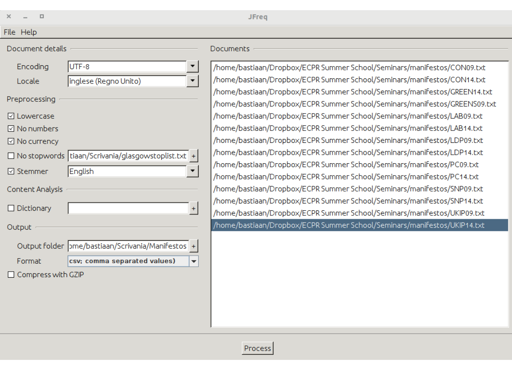

# Importing Data{#importing-data}

Before we can do any kind of analysis, we need to get our text into R. Here we look at five different ways of doing this: a) using .txt files, b) using .pdf files, c) using .csv files, d) using an API, and e) using web scraping techniques. Before we do that, though, let us first look at how R looks at text in the first place, and what some of the most basic things we can do with text there are.

## Text in R

R sees any form of text as a vector consisting of different types of characters. In their simplest form, these vectors only have a single character in them. At their most complicated, they can contain many sentences or even whole stories. To see how many characters a vector has, we can use the `nchar` function:

```{r vector-nchar, tidy=TRUE}
vector1 <- 'This is the first of our character vectors'
nchar(vector1)
length(vector1)
```

This example also shows the logic of R. First, we assign the text we have to a certain object. We do so using the `<-` arrow. This arrow points from the text we have to the object R stores it in, which we here call `vector1`. We then ask R to give us the number of characters inside this object, which is 40 in this case. The `length` command returns something else, namely 1. This means that we have a single sentence, or word, in our object. If we want to, we can place more sentences inside our object using the `c()` option:

```{r vector-c, tidy=TRUE}
vector2 <- c('This is an example', 'This is another', 'And so we can go on.')
length(vector2)
nchar(vector2)
sum(nchar(vector2))
```

Another thing we can do is extract certain words from a sentence. For this, we use the `substr()` function. With this function, R gives us all the characters that occur between two specific positions. So, when we want the characters between the 4th and 10th characters, we write:

```{r vector-substr, tidy=TRUE}
vector3 <- 'This is yet another sentence'
substr(vector3, 4, 10)
```

We can also split a character vector into smaller parts. We often do this when we want to split a longer text into several sentences. To do so, we use the `strsplit` function:

```{r vector-strsplit1, tidy=TRUE}
vector3 <- 'Here is a sentence - And a second'
parts1 <- strsplit(vector3, '-')
parts1
```

If we now look in the Environment window, we will see that R calls `parts1` a list. This is another type of object that R uses to store information. We will see it more often later on. For now, it is good to remember that lists in R can have many vectors (the layers of the list) and that in each of these vectors we can store many objects. Here, our list has only a single vector. To create a longer list, we have to add more vectors, and then join them together, again using the `c()` command:

```{r vector-strsplit2, tidy=TRUE}
vector4 <- 'Here is another sentence - And one more'
parts2 <- strsplit(vector4, '-')
parts3 <- c(parts1, parts2)
```

We can now look at this new list in the Environment and check that it indeed has two elements. A further thing we can do is to join many vectors together. For this, we can use the `paste` function. Here, the `sep` argument defines how R will combine the elements:

```{r vector-paste1,  tidy=TRUE}
fruits <- paste('oranges','lemons','pears', sep = '-')
fruits
```

Note that we can also use this command that pastes objects that we made earlier together. For example:

```{r vector-paste2, tidy=TRUE}
sentences <- paste(vector3, vector4, sep = '.')
sentences
```

Finally, we can change the case (lowercase, uppercase) of the sentence. To do this, we can use `tolower` and `toupper`:

```{r vector-lowerupper1, tidy=TRUE}
tolower(sentences)
toupper(sentences)
```

Again, we can also run the same command when we have more than a single element in our vector:

```{r vector-lowerupper2, tidy=TRUE}
sentences2 <- c("This is a piece of example text", "This is another piece of example text")
toupper(sentences2)
tolower(sentences2)
```

And that is it. As you can see, the options for text analysis in basic R are rather limited. This is why packages such as `quanteda` exist in the first place. Note though, that even `quanteda` uses the same logic of character vectors and combinations that we saw here.

## Import .txt Files

The .txt format is one of the most common formats to store texts in. Not only are these files format-free, but they are also small in size, support a wide array of characters, and are readable on all platforms. To read them into R, we first specify where on our computer these files are. Here they are in a folder called **Texts** in our Working Directory. To tell R where this is, we first set our working directory (to see where your current Working Directory is, type `getwd()` into the Console). Then, we add `/Texts` to this and save it as `txt_directory`. We can then use this to refer to this folder when we import the files using `readtext`:

```{r import-txt, tidy=TRUE, eval=FALSE}
library(readtext)
setwd("Your Working Directory")
txt_directory <- paste0(getwd(),"/Texts")
data_texts <- readtext(paste0(txt_directory, "*"), encoding = "UTF-8")
```

Note that now you not only have the texts in your environment but the object `txt_directory` as well. Note that this is nothing more than a string that we can use later on to prevent us from having to type the whole address of the folder.

## Import .pdf Files

Apart from .txt, .pdf files are another common format for texts. Yet, as .pdf files contain a lot of information (tables, figures and graphs), besides the texts, we will have to "get out" the texts first. To do so, we first use the `pdftools` package to convert the .pdf files into .txt files, which we then read (as above) with `readtext`. Note that this only works if the .pdf files are *readable*. This means that we can select (and copy-paste) the text in them. Thus, `readtext` does not work with .pdf files where we cannot select the text. Often this happens when a .pdf is a scan or contains many figures. In such cases, you might have to use optical character recognition (OCR) (such as offered by the [`tesseract`](https://github.com/tesseract-ocr/tesseract) package) to generate the .txt files.

As with the .txt files above, here we will place our .pdf files in a folder called **PDF** in our Working Directory. Also, we have an (empty) folder called **Texts** where R will write the new .txt files to. We then tell R where these folder are:

```{r define-directories, tidy=TRUE, results=FALSE, eval=FALSE}
library(pdftools)
library(readtext)

pdf_directory <- paste0(getwd(),"/PDF")
txt_directory <- paste0(getwd(),"/Texts")
```

Then, we ask R for a list of all the files in the .pdf directory. This is both to ensure that we are not overlooking anything and to tell R which files are in the folder. Here, setting `recurse=FALSE` means that we only list the files in the main folder and not any files that are in other folders in this main folder.

```{r list-pdffiles, tidy=TRUE, results=FALSE, eval=FALSE}
files <- list.files(pdf_directory, pattern = ".pdf", recursive = FALSE, full.names = TRUE)

files
```

While we could convert a single document at a time, more often we have to deal with more than one document. To read all documents at once, we have to write a little function. This function does the following. Firstly, we tell R to make a new function that we label `extract`, and as input give it an element we call `filename`. This file name is at this point an empty element, but to which we will later refer to the files we want to extract. Then, we ask R to print the file name to ensure that we are working with the right files while the function is running. In the next step, we ask R to try to read this file name using the `pdf_text` function and save the result as a file called `text`. Afterwards, we ask R to do so for each of the files that end on .pdf that are in the element `files`. Then, we have R write this text file to a new file. This file is the extracted .pdf in .txt form:

```{r function-extract, results=FALSE, eval=FALSE}
extract <- function(filename) {
  print(filename)
  try({
    text <- pdf_text(filename)
  })
  title <- gsub("(.*)/([^/]*).pdf", "\\2", filename)
  write(text, file.path(txt_directory, paste0(title, ".txt")))
}
```

We then use this function to extract all the .pdf files in the `pdf_directory` folder. To do so, we use a `for` loop. The logic of this loop is that for each individual `file` in the element `files`, we run the `extract` function we created. This will create an element called `file` for the file R is currently working on, and will create the .txt files in the `txt_directory`:

```{r loop-pdffiles, results=FALSE, eval=FALSE}
for(file in files) {
 extract(file)
}
```

We can now read the .txt files into R. To do so, we use `paste0(txt_directory, "*")` to tell `readtext` to look into our `txt_directory`, and read any file in there. Besides this, we need to specify the encoding. Most often, this is **UTF-8**, though sometimes you might find **latin1** or **Windows-1252** encodings. While `readtext` will convert all these to **UTF-8**, you have to specify the original encoding. To find out which one you need, you have to look into the properties of the .txt file.

Assuming our texts are in UTF-8 encoding, we run:

```{r readtext-pdffiles, tidy=TRUE, eval=FALSE}
data_texts <- readtext(paste0(txt_directory, "*"), encoding = "UTF-8")
```

The result of this is a data frame of texts, which we can transform into a corpus for use in `quanteda` or keep as it is for other types of analyses.

## Import .csv Files

We can also choose not to import the texts into R in a direct fashion, but import a .csv file with word counts instead. One way to generate these counts is by using JFreq [@Lowe2011b]. This stand-alone programme generates a .csv file where rows represent the documents and columns the individual words. The cells then contain the word counts for each word within each document. In addition, JFreq also allows for some basic pre-processing (though we would suggest you do this in R). Note that while JFreq is not under active maintenance, you can still find it at https://conjugateprior.org/software/jfreq/.

To use JFreq, open the programme and drag and drop all the documents you want to process into the window of the programme. Once you do this, the document file names will appear in the document window. Then, you can choose from several pre-processing options. Amongst these are options to make all words lower-case or remove numbers, currency symbols, or stop words. The latter are words that often appear in texts which do not carry important meaning. These are words such as 'and', 'or' and 'but'. As stop words are language-specific and often context-specific as well, we need to tell JFreq what words are stop words. We can do so by putting all the stop words in a separate .txt file and load it in JFreq. You can also find many lists of stop words for different languages on-line (see, for example [this collection](https://github.com/igorbrigadir/stopwords)). Finally, we can apply a stemmer which reduces words such as 'Europe' and 'European' to a single 'Europ*' stem. JFreq allows us to use pre-defined stemmers by choosing the relevant language from a drop-down menu. Figure \@ref(fig:figure-jfreq) shows JFreq while importing the .txt files of some electoral manifestos.

\
```{r figure-jfreq, out.width = "100%", echo=FALSE, fig.cap='Overview of JFreq with several documents loaded'}

```
\

Note that here the encoding is UTF-8 while the locale is English (UK). Once we have specified all the options we want, we give a name for the output folder and press **Process**. Now we go to that folder we named and copy-paste the **data.csv** file into your Working Directory. In R, we then run the following:

```{r read-datacsv, eval=FALSE}
data_manifestos <- read.csv("data.csv", row.names = 1, header = TRUE)
```

By specifying `row.names=1`, we store the information of the first column in the data frame itself. This column contains the names of the documents, and belongs to the object of the data frame and does not appear as a separate column. The same is true for `header=TRUE` which ensures that the first row gives names to the columns (in this case containing the words).

## Import from an API

Another way to import texts is by using an Application Programming Interface (API). While comparable to web scraping, APIs are much more user friendly and communicate better with R. This makes it easier to download a large amount of data at once and import the results into R. There are APIs for many popular websites, such as Wikipedia, Twitter, YouTube, Weather Underground, The New York Times, the European Union and so on. Note, however, that you often, if not always, need to register before you can use an API. Moreover, social media platforms such as Facebook and Twitter have recently introduced restrictions in the use of their APIs that have limited researchers’ ability to conduct critical scholarly research [@Bruns2019a]. For instance, Facebook has taken steps in restricting access to their public APIs for research purposes. As such, free research on Facebook users' posts is no longer an option [@Freelon2018a; @Perriam2020a]. Even more recently, Twitter (rebranded as ‘X’ in July 2023) has [eliminated the free access](https://edition.cnn.com/2023/02/03/tech/twitter-api-what-is-pricing-change-cec/index.html) to its API for third-party developers. At the time of writing, the `Basic’ subscription that costs $100 per month allows you to create a project to pull up to 10,000 Tweets.

While web scraping, in general, is easy with the `rvest` package, for the APIs you often need a specific package. For example, for Twitter there is the `rtweet` package, for Facebook `Rfacebook`, and `ggmap` for Google maps. Moreover, there are many APIs with associated R packages made by researchers for researchers, such as `manifestoR`, a package that provides researchers access to the corpus of the Manifesto Project (@Merz2016a). 

Let's look at an example using an API for the *New York Times*. If you look at the *New York Times*’s API page (https://developer.nytimes.com/), you will find that we use the API to extract information ranging from opinion articles to book reviews, movie reviews, and so on. In our example, we will use the API to extract a corpus of movie reviews that were originally published in the *New York Times*.

Before we start here, we first have to gain permission to use the API. For this, you need to register an account at the website and log in. Then, make a new **app** under: **https://developer.nytimes.com/my-apps** and ensure you select the movie reviews. Then, you can click on the new app to see your key under **API Keys**. It is this string of codes and letters you will have to place at the `[YOUR_API_KEY_HERE]` bit shown below.

Now, let us first load the necessary packages:

```{r load-tidyverse, message=FALSE, results=FALSE, warning=FALSE, tidy=TRUE}
library(tidyverse)
library(httr)
library(jsonlite)
```

We can then build our request. As you can see on the site, the request requires us to give a search term (here we choose "love"). Also, we can set a time frame from which we want to extract the reviews:

```{r json-notinclude, include=FALSE, tidy=TRUE, message=FALSE, warning=FALSE, eval=FALSE}
reviews <- fromJSON("https://api.nytimes.com/svc/movies/v2/reviews/search.json?query=love&opening-date=2000-01-01:2020-01-01&api-key=[YOUR_API_KEY_HERE]")
```

```{r json-include, eval=FALSE, tidy=TRUE, message=FALSE, warning=FALSE, eval=FALSE}
reviews <- fromJSON("https://api.nytimes.com/svc/movies/v2/reviews/search.json?query=love&opening-date=2000-01-01:2020-01-01&api-key=[YOUR_API_KEY_HERE]")
```

The result is a JSON object that you can see in the environment. While JSON (JavaScript Object Notation) is a generic way in which information is easy to share, and is thus often used, it is not in an ideal form. So, we change the JSON information to a data frame using the following:

```{r json-todataframe-notinclude, include=FALSE, tidy=TRUE, message=FALSE, warning=FALSE, eval=FALSE}
reviews_df <- fromJSON("https://api.nytimes.com/svc/movies/v2/reviews/search.json?query=love&opening-date=2000-01-01:2020-01-01&api-key=[YOUR_API_KEY_HERE]", flatten = TRUE) %>%
 data.frame()
```

```{r json-todataframe-include, eval=FALSE, tidy=TRUE, message=FALSE, warning=FALSE, eval=FALSE}
reviews_df <- fromJSON("https://api.nytimes.com/svc/movies/v2/reviews/search.json?query=love&opening-date=2000-01-01:2020-01-01&api-key=[YOUR_API_KEY_HERE]", flatten = TRUE) %>%
 data.frame()
```

You can now find all the information in the new `reviews_df` object, which also contains other useful information about each movie. As we can see, having a package makes things easier, though more limited.

## Import using Web Scraping

If there is no specific API, we can also choose to scrape the website. The logic of web scraping is that we use the structure of the underlying HTML document to find and download the text we want. Note though that not all websites encourage (or even allow) scraping, which means that we need to have a look at their disclaimer beforehand. You can do this by either checking the website's **Terms and Conditions** page, or the **robots.txt** file that you can usually find appended at the home page (e.g. https://www.facebook.com/robots.txt ).

One easy way to scrape a website is to search and see whether someone else has already built a tool that automates the webscraping process for the particular website that we are interested in. For instance, since Twitter has ended the free access to its API, we can look at places like [Apify](https://apify.com/store?ref=blog.apify.com) to find a suitable scraper for popular websites such as Twitter/X, Wikipedia, Instagram (to scrape data on public profiles), Google search, Google maps, Tiktok, Amazon (to scrape data on its products), and so on. Apify is not free, but registering an account for a free trial and using a month’s subscription may be enough for a small project.

If you cannot find a ready-made scraper for your project, or if you cannot pay for such services, you can use `rvest` package to configure a webscraper of your own. One of the most popular sites to scrape is Wikipedia as it is very welcoming to web scraping and has pages with a clear structure (indeed, underlying sites such as WikiData are built with web scraping in mind). Here, let us take the following page on the Cold War as an example: https://en.wikipedia.org/wiki/Cold_War. If you have a quick look at the website you see that there is a lot of information on there, including figures, tables and the actual body of text. Here, we are only interested in the latter.

To begin with, we store the address of the webpage in an object and ask R to read it for us:

```{r data-coldwar0, tidy=TRUE}
url <- "https://en.wikipedia.org/wiki/Cold_War"
url <- rvest::read_html(url)
```

We now have the HTML page (though R will not yet show it), but we before we can do anything further, we have to figure out how to get the content we want. To do so, we have to inspect the HTML document to find the right element. The easiest way to do this is in the browser. To do so, open the page and use **Cmd + Shift + C** to open up Developer Tools. In the tools that then open, we can hover over the main body of text on the page and see which element belongs to it. Here, we find that the main body of text is stored in an element called **mw-content-text** and that within that the individual paragraphs are stored in elements labelled **<p>**. This latter designation is a standard reference in HTML to individual paragraphs and are what we are after here.

We now ask R to take the HTML extracted from the URL, look only for the nodes labelled **<p>**, extract the text from it, place the results into a data frame, and then into a character vector:

```{r data-coldwar1, tidy=TRUE}
library(rvest)

data_coldwar <- url %>% 
  html_nodes("p") %>% 
  html_text2()  %>%
  as.data.frame()
data_coldwar <- data_coldwar$.
data_coldwar <- data_coldwar[-c(1,2)]
```

Note that for the text we can choose to use either ``html_text`` or ``html_text2``. The difference between the two is that while the former gives us the raw underlying text, the latter gives us the text as it looks like in the browser, which is what we opt for here. Now, looking at the resulting data-frame, we have 207 observations representing the 207 paragraphs of the text (with the first two empty, so we removed them here). We can then use this as an input for any further analysis (and we will get back to this later). If you would like to learn more about web scraping in the context of quantitative text analysis have a look at the textbook by @Munzert2014a.
