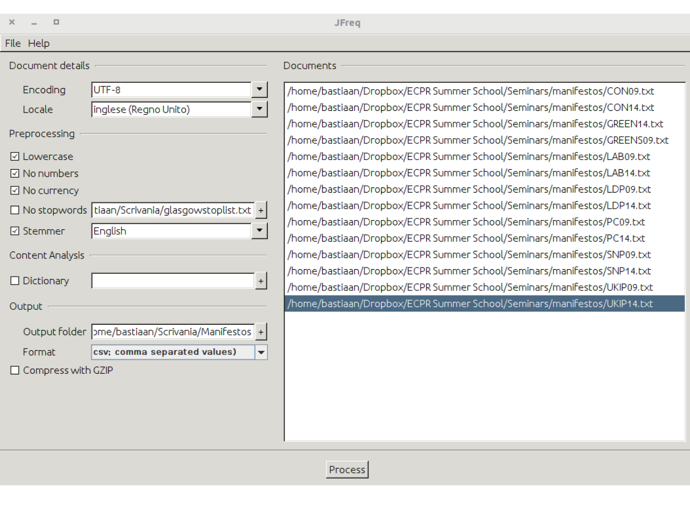
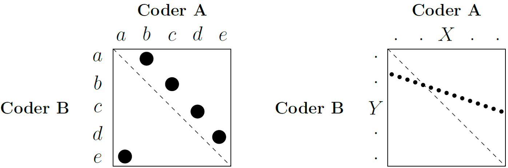
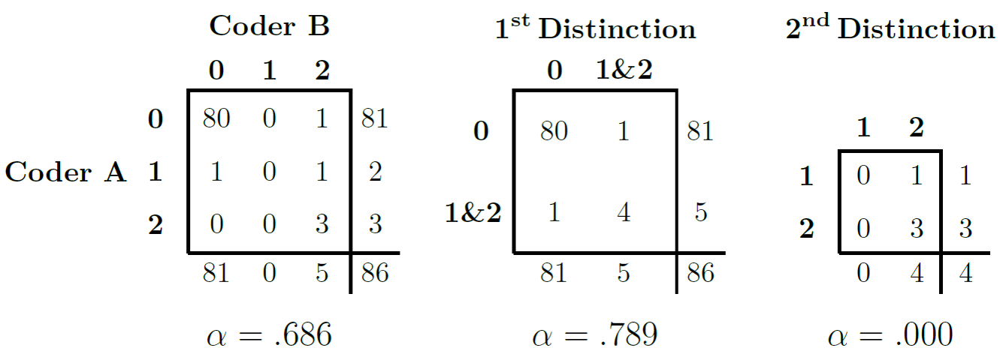

--- 
title: "Quantitative Text Analysis"
author: "Kostas Gemenis & Bastiaan Bruinsma"
date: "`r Sys.Date()`"
bibliography: library.bib
biblio-style: apalike
link-citations: yes
description: Theory and Methods for Quantitative Text Analysis
site: bookdown::bookdown_site
output:
  bookdown::gitbook:
    config:
      toolbar:
        position: static
documentclass: book
---

# Foreword

Welcome to the Quantitative Content Analysis Textbook. This book was originally written as a collection of assignments and slides for the ECPR Winter and Summer Schools. Note that the book is still in active development.


<!--chapter:end:index.Rmd-->

# Getting Ready

The developments over the past 20 years have made research using quantitative text analysis a particularly exciting undertaking. 

First of all, the enormous increase in computing power has made it possible to work with large bodies of text. Secondly, the development of R, a free, open-source, cross-platform statistical software has enabled many researchers and programmers to develop particular packages that implement statistical methods of working with text. In addition, the spread of the Internet has made available in digital format many interesting sources of textual data. To these, we should add the emergence of social media as a massive source of text which is generated daily, by millions of users across the world.

Yet, quantitative text analysis can be a daunting experience for someone who is not familiar with quantitative methods or programming. This book will guide you, with step-by-step explanation of the code, through a series of exercises illustrating a wide range of text analysis methods. Many of these exercises have been given to participants in the ECPR Summer and Winter Schools in Methods and Techniques whom, often, had no prior experience in text analysis, R, or quantitative methods. Therefore, we hope that you will find the exercises easy to understand but also engaging.

Before we start, however, we have to ensure that we have everything that we need in our system. This means: a) installing R, b) installing RStudio, c) installing ```quanteda```, and d) installing several other packages.

## Installing R

R is an open-source programme that allows you to carry out a wide variety of statistical tasks. At its core, it is a modification of the programming languages S and Scheme, making it not only flexible but fast as well. R is available for Windows, Linux and OS X and receives regular updates. In its basic version, R uses a simple command-line interface. To give it a friendlier look, integrated development environments (IDEs) such as RStudio are available. Apart from looking better, these environments also provide some extra practical features.

### R on Windows

To install R on Windows, go to https://cran.r-project.org/bin/windows/base/, download the file, double-click it and run it. Whilst installing, it is best to leave standard options (such as the installation folder) unchanged. This makes it easier for other programmes to know where to find R. Once installed, you will find two shortcuts for R on your desktop. These refer to each of the two versions of R that come with the installation - the 32-bit and the 64-bit version. Which version you need depends on your version of Windows. To see which version of Windows you have, go to This PC (or My Computer, right-click it, and select Properties. Here you should find the version of Windows installed on your PC. If you have the 64-bit version of Windows, you can use both versions. Yet, it is best to use the 64-bit version as this makes better use of the memory of your computer and thus runs smoother. If you have the 32-bit version of Windows, you have to use the 32-bit version of R.

To install RStudio, go to https://www.rstudio.com/products/rstudio/download/, and download the free version of RStudio at the bottom of the page. Make sure to choose **Installers for Supported Platforms** and pick the option for Windows. Once downloaded, install the programme, leaving all settings unchanged. If everything works out fine, RStudio will have found your installation of R and placed a shortcut on the desktop. Whether you have the 32-bit or 64-bit version of Windows or R does not matter for RStudio. What does matter are the slashes. R uses forward slashes (/) instead of the backslashes (``\``) that Windows uses. Thus, whenever you specify a folder or file within R, make sure to invert the slashes. So, you should refer to a file which in Windows has the address **C:\\Users\\Desktop\\data.csv** as **C:/Users/Desktop/data.csv**.

### R on Linux

How to install R on Linux depends on which flavour of Linux you have. In most cases, R is already part of your Linux distribution. You can check this by opening a terminal and typing ``R``. If installed, R will launch in the terminal. If R is not part of your system, run the following in the terminal:

1. sudo add-apt-repository 'deb https://cloud.r-project.org/bin/linux/ubuntu focal-cran40/'
2. sudo apt-key adv --keyserver keyserver.ubuntu.com --recv-keys E298A3A825C0D65DFD57CBB651716619E084DAB9
3. sudo apt update
4. sudo apt install r-base r-base-core r-recommended r-base-dev

As an alternative, you can use the Synaptic Package Manager and look for the **r-base-dev** and **r-base** packages. Select them, and install them. 

To install RStudio, go to https://www.rstudio.com/products/rstudio/download/. At the bottom of the page, pick the installer that corresponds to your OS. Then, install the file either through an installation manager or via the terminal. After running the launcher, you can find RStudio in the Dash.

### R on macOS

With OS X you must have OS X 10.6 (Snow Leopard) or above. Installing R otherwise is still possible, but you cannot use a certain number of packages (such as some we use here). To check this, click on the Apple icon in the top-left of your screen. Then, click on the "About This Mac" options. A window should then appear that tells you which version of OS X (or macOS) you have. 

To install R, go to https://cran.r-project.org/index.html and click **Download R for (Mac) OS X**. Once there, download the .pkg file that corresponds to your version of OS X and install it. Besides, you have to download the **Clang 6.x compiler** and the **GNU Fortran compiler** from  https://cran.r-project.org/bin/macosx/tools/. Install both and leave the selected options as they are. After the installation, check if R works by launching the programme. 

To install RStudio, go to https://www.rstudio.com/products/rstudio/download/ and download the OSX version at the bottom of the page. After downloading and installing, you can now find RStudio with your other programmes.

### R in the Cloud

Aside form installing R on your own system, you can also choose to use its cloud version. This version is hosted by RStudio on https://rstudio.cloud/. To use it, go to the Sign-Up button in the top-right of the screen. Then, select the *Cloud Free* option and once again select Sign-Up. Then, finish the procedure either by filling in your data, or connecting with your Google or GitHub account. Once done, log-in, and you will arrive at your workspace. To get started, you need to make a new project. To do so, click the *New Project* button which takes you to an instance of RStudio. From here on, the programme functions the same as its Desktop version. Note that everything you do - or packages you install - in the project *remain* in the project. Thus, you will have to re-install them if you want to create a new project. Besides, note that RStudio Cloud is quite dependent on both the number of users on the server and your internet connection. Thus, some actions (such as installing packages) might take longer to run.

## Packages

R on its own is a pretty bare-bones experience. What makes it work are the many packages that exist for it. These packages come in two kinds: officially released or in development. 

### Installing from CRAN

To be officially released, the package needs to be part of CRAN: the Comprehensive R Archive Network. CRAN is a website that collects and hosts all the material R needs, such as the different distributions, packages, and more. Besides, any package on CRAN has gone through a vetting process. This ensures that the package does not contain any major bugs, has README and NEWS files, and has a clear version number. Many official released packages also have additional documentation and motivating examples published in journals such as *The R Journal* and *The Journal of Statistical Software*. Also, a package being published in CRAN allows us to install the package using the ```install.packages``` command, or the **Packages** tab in RStudio. Besides, packages on CRAN often receive updates on a regular basis. These updates can add new features to the package, address bugs, or increase performance. To update your packages, go to the **Packages** tab in RStudio and click on the **Update** button. 

### Installing from GitHub

Some packages that have not yet had an official release are in development on GitHub (https://github.com/). As a result, these packages change very often and are more unstable as their official counterparts. We can, nevertheless, install packages from Github using the ```devtools``` package. To install this, type:

```{r, eval=FALSE}
install.packages("devtools", dependencies=TRUE)
```

Here, ``dependencies=TRUE`` ensures that if we need other packages to make ```devtools``` work, R will install these as well.

Depending on your operating system, you might have to install some other software for ```devtools``` to work.

On Windows, ```devtools``` requires the *RTools* software. To install this, go to https://cran.r-project.org/bin/windows/Rtools/, download the latest *recommended* version (in green), and install it. Then re-open R again and install ```devtools``` as shown above.

On Linux, how ```devtools``` installs depends on the flavour of Linux that you have. Most often, installing it as shown above will work fine. If not, the problem is most likely a missing package in your Linux distribution. To address this, close R, open a terminal and type:

1. sudo apt-get update
2. sudo apt-get upgrade
3. sudo apt install build-essential libcurl4-gnutls-dev libxml2-dev libssl-dev
4. Close the terminal, open R, and install ```devtools``` as shown above.

On OSX (or macOS), ```devtools``` requires the *XCode* software. To install this, follow these steps:

1. Launch the terminal (which you can find in /Applications/Utilities/), and type:
2. In the terminal, type: **xcode-select --install**
3. A software update window should pop up. Here, click "Install" and agree to the Terms of Service.
4. Go to R and install ```devtools``` as shown above.

## Quanteda

While we will be using several different packages to run quantitative text analysis, we will mostly use ```quanteda``` (@Benoit2018). ```quanteda``` integrates many of the text analysis functions of R that were before spread out over many different packages (see, for example @Welbers2017). Besides, it is easy to combine with other packages, has simple and logical commands, and a well-maintained website (www.quanteda.io).

The current version of ```quanteda``` as of writing is 2.0.1. This version works best with R version 4.0.1 or higher. To check if your system has this, type ```R.Version()``` in your console. The result will be a list. Look for ```$version.string``` to see which version number your version of R is. If you do not have the latest version, see the steps above on how to download this. 

To install the package, type:

```{r, eval=FALSE}
install.packages("quanteda", dependencies=TRUE)
install.packages("quanteda.textplots", dependencies = TRUE)
```

Besides this, there are several sister-packages of ```quanteda``` that contain functions that are not yet part of the main package. Often, these packages will become part of the main package at a later date. As they are still in development, they are not yet on CRAN, but still on GitHub. Install two of them (```quanteda.classifiers``` which we will use for supervised learning methods, and ```quanteda.dictionaries``` which we will use for dictionary analysis), and also install this package (also still in development) for the bootstrap version of Krippendorff's $\alpha$:

```{r, eval=FALSE}
library(devtools)
install_github("quanteda/quanteda.classifiers", dependencies = TRUE)
install_github("kbenoit/quanteda.dictionaries", dependencies = TRUE)
install_github("mikegruz/kripp.boot", dependencies = TRUE)
```

Apart from ```quanteda``` we then need seven other packages to work, which are all available on CRAN:

```{r, eval=FALSE}
install.packages("ca", dependencies = TRUE)
install.packages("combinat", dependencies = TRUE)
install.packages("factoextra", dependencies = TRUE)
install.packages("Hmisc", dependencies = TRUE)
install.packages("httr", dependencies = TRUE)
install.packages("jsonlite")
install.packages("manifestoR", dependencies = TRUE)
install.packages("readr", dependencies = TRUE)
install.packages("readtext", dependencies = TRUE)
install.packages("RTextTools", dependencies = TRUE)
install.packages("R.temis", dependencies = TRUE)
install.packages("rvest", dependencies = TRUE)
install.packages("tidyverse", dependencies = TRUE)
```

After installation, you will find these packages, as well as the ```quanteda``` and ```devtools``` packages, under the **Packages** tab in RStudio.

## Issues, Bugs and Errors

As it is free software, errors are not uncommon in R. Often they arise when you misspell the code or use the wrong code for the job at hand. In these cases, R prints a message (in red) telling you why it cannot do what you ask of it. Sometimes, this message is quite clear, such as telling you to install an extra package. Other times, it is more complicated and requires some extra work. In these cases, there are four questions you can ask yourself:

1. Did I load all the packages I need?
2. Are all packages up-to-date?
3. Did I spell the commands correct?
4. Is the data in the right shape or format?

If none of these provides a solution, you can always look up online if others have run into the same issue. Often, copy-pasting your error into a search engine can provide you with other instances, and most often a solution. One well-known place for solutions is Stack Overflow (https://stackoverflow.com/). Here, you can share your problem with others and see if someone can offer a solution. Make sure though to read through the problems already posted first, to ensure that you do not post the same problem twice.

<!--chapter:end:01-Install.Rmd-->

# Preparing the Data

No analysis is possible unless we have some data to work with. In the following exercises, we will look at five different ways to get textual data into R: a) by using .pdf files, b) by using .txt files, c) by using .csv files, d) by using web scraping, and e) by using an API. Before we get to these methods, we will look at how R handles text and how we can work with it.

## Text in R

R sees any form of text as a type of characters vector. In their simplest form, these vectors only have a single character in it. At their most complicated, they can contain many sentences or even whole stories. To see how many characters a vector has, we can use the `nchar` function:

```{r, tidy=TRUE, tidy.opts = list(width.cutoff = 60)}
vector1 <- 'This is the first of our character vectors'
nchar(vector1)
length(vector1)
```

This example also shows the logic of R. First, we assign the text we have to a certain object. We do so using the `<-` arrow. This arrow points from the text we have to the object R stores it in, which we here call `vector1`. We then ask R to give us the number of characters inside this object, 40 in this case. The `length` command returns something else, namely 1. This means that we have a single sentence, or word, in our object. If we want to, we can place more sentences inside our object using the `c()` option:

```{r, tidy=TRUE, tidy.opts = list(width.cutoff = 60)}
vector2 <- c('This is an example', 'This is another', 'And so we can go on.')
length(vector2)
nchar(vector2)
sum(nchar(vector2))
```

Another thing we can do is extract certain words from a sentence. For this, we use the `substr()` function. With this function, R gives us all the characters that occur between two specific positions. So, when we want the characters between the 4th and 10th characters, we write:

```{r, tidy=TRUE, tidy.opts = list(width.cutoff = 60)}
vector3 <- 'This is yet another sentence'
substr(vector3, 4, 10)
```

We can also split a character vector into smaller parts. We often do this when we want to split a longer text into several sentences. To do so, we use the `strsplit` function:

```{r, tidy=TRUE, tidy.opts = list(width.cutoff = 60)}
vector3 <- 'Here is a sentence - And a second'
parts1 <- strsplit(vector3, '-')
parts1
```

If we now look in the Environment window, we will see that R calls `parts1` a list. This is another type of object that R uses to store information. We will see it more often later on. For now, it is good to remember that lists in R can have many vectors (the layers of the list) and that in each of these vectors we can store many objects. Here, our list has only a single vector. To create a longer list, we have to add more vectors, and then join them together, again using the `c()` command:

```{r, tidy=TRUE, tidy.opts = list(width.cutoff = 60)}
vector4 <- 'Here is another sentence - And one more'
parts2 <- strsplit(vector4, '-')
parts3 <- c(parts1, parts2)
```

We can now look at this new list in the Environment and check that it indeed has two elements. A further thing we can do is to join many vectors together. For this, we can use the `paste` function. Here, the `sep` argument defines how R will combine the elements:

```{r, tidy=TRUE, tidy.opts = list(width.cutoff = 60)}
fruits <- paste('oranges','lemons','pears', sep = '-')
fruits
```

Note that we can also use this command that paste objects that we made earlier together. For example:

```{r, tidy=TRUE, tidy.opts = list(width.cutoff = 60)}
sentences <- paste(vector3, vector4, sep = '.')
sentences 
```

Finally, we can change the case of the sentence. To do this, we can use `tolower` and `toupper`:

```{r, tidy=TRUE, tidy.opts = list(width.cutoff = 60)}
tolower(sentences)
toupper(sentences)
```

Again, we can also run the same command when we have more than a single element in our vector:

```{r, tidy=TRUE, tidy.opts = list(width.cutoff = 60)}
sentences2 <- c("This is a piece of example text", "This is another piece of example text")
toupper(sentences2)
tolower(sentences2)
```

And that is it. As you can see, the options for text analysis in basic R are rather limited. This is why packages such as ```quanteda``` exist in the first place. Note though, that even ```quanteda``` uses the same logic of character vectors and combinations that we saw here.

## Import .pdf Files

One of the most popular formats for digital texts is the portable document format (.pdf). To read .pdf files into R, we need two packages. The `pdftools` package to convert the .pdf files into .txt files, and the `readtext` package to read the .txt files into R. Note that this only works if the .pdf files are *readable*. This means that we can select (and copy-paste) the text in them. Thus, `readtext` does not work with .pdf files that the text in them cannot be selected (this is most likely because the pages of the document were scanned as images before turned into a .pdf file). If we have a .pdf file of this type, one solution is to use the `tesseract` package, which can use optical character recognition technology (OCR) to fix this issue.

To import the .pdf files, we start by loading the required libraries into R:

```{r, tidy=TRUE, tidy.opts = list(width.cutoff = 60), eval=FALSE}
library(pdftools)
library(readtext)
```

Then, we go to our working directory (to see where this is, type `getwd()` into the Console). Here, we make two folders: one in which to store the .pdf files - called *PDF* - and another new and empty folder in which to store the .txt files. We call this one *Texts*. Ensure that all the .pdf files are in the *PDF* folder. Then, we tell R about these folders:

```{r, tidy=TRUE, tidy.opts = list(width.cutoff = 60), results=FALSE, eval=FALSE}
pdf_directory <- paste0(getwd(),"/PDF")
txt_directory <- paste0(getwd(),"/Texts")
```

Then, we ask R for a list of all the files in the .pdf directory. This is both to ensure that we are not overlooking anything and to tell R which files are in the folder. Here, setting `recurse=FALSE` means that we only list the files in the main folder and not any files that are in other folders in this main folder.

```{r, tidy=TRUE, tidy.opts = list(width.cutoff = 60), results=FALSE, eval=FALSE}
files <-list.files(pdf_directory, pattern = ".pdf", recursive = FALSE,full.names = TRUE)

files
```

While we could convert a single document at a time, more often we have to deal with more than one document. To read all documents in at once, we have to write a little function. This function does the following. First, we tell R to make a new function that we label `extract`, and as input give it an element we call `filename`. This filename is at this point an empty element, but to which we will later refer the files we want to extract. Then, we tell it to print the file name to ensure that we are working with the right files while the function is running. In the next step, we tell it to try to read this filename using the `pdf_text` function and save the result as a file called `text`. Afterwards, we tell it to do so for each of the files that end on .pdf that are in the element `files`. Then, we have it write this text file to a new file. This file is the extracted .pdf in .txt form:

```{r, tidy=TRUE, tidy.opts = list(width.cutoff = 60), results=FALSE, eval=FALSE}
extract <- function(filename) {
 print(filename)
 try({text <-pdf_text(filename)})
 f <-gsub("(.*)/([^/]*).pdf", "\\2", filename)
 write(text,file.path(txt_directory,paste0(f, ".txt")))
}
```

We then use this function to extract all the pdf files in the `pdf_directory` folder. To do so, we use a `for` loop. The logic of this loop is that for each individual `file` in the element `files`, we run the `extract` function we created. This will create an element called `file` for the file R is currently working on, and will create the .txt files in the `txt_directory`:

```{r, tidy=TRUE, tidy.opts = list(width.cutoff = 60), results=FALSE, eval=FALSE}
for(file in files) {
 extract(file)
}
```

We can now read the .txt files into R. To do so, we use `paste0(txt_directory, "*")` to tell `readtext` to look into our `txt_directory`, and read any file in there. Besides this, we need to specify the encoding. Most often, this is **UTF-8**, though sometimes you might find **latin1** or **Windows-1252** encodings. While `readtext` will convert all these to **UTF-8**, you have to specify the original encoding. To find out which one you need, you have to look into the properties of the .txt file.

Assuming our texts are in UTF-8 encoding, we run:

```{r, tidy=TRUE, tidy.opts = list(width.cutoff = 60), eval=FALSE}
data_texts <- readtext(paste0(txt_directory, "*"), encoding = "UTF-8")
```

The result of this is a data frame of texts, which we can transform into a corpus for use in `quanteda` or keep as it is for other types of analyses.

## Import .txt Files

In case that we already have the .txt files somewhere, we can make the above process a bit easier, and begin at the last step:

```{r, tidy=TRUE, tidy.opts = list(width.cutoff = 60), eval=FALSE}
library(readtext)

directory <-getwd()
data_texts <-readtext(paste0(txt_directory, "*"), encoding = "UTF-8")
```

## Import .csv Files

We can also choose not to import the texts into R in a direct fashion, but import a .csv file with word counts instead. One way to generate these counts is by using JFreq [@Lowe2011b]. This is a useful stand-alone programme written in Java that generates a .csv file where the rows represent the documents and the columns represent the individual words contained in the documents. The cells therefore, contain the wordcounts for each word within each document. JFreq also allows performing some basic pre-processing. JFreq is not actively maintained, but is available at https://conjugateprior.org/software/jfreq/. 

To use JFreq, open the programme and drag and drop all the documents you want to process into the window of the programme. Once you do this, the document file names will appear in the document window. Then, you can choose from several pre-processing options. Amongst these are options to make all words lowercase or remove numbers, currency symbols, or stop words. The latter are words that often appear in texts which do not carry an important meaning. These are words such as ``and'', ``or'' and ``but''. As stop words are language-specific and often context-specific as well, we need to tell JFreq what words are stop words. We can do so by putting all the stop words in a separate .txt file and load it in JFreq. You can also find many lists of stopwords for different languages online. For instance, many different lists of stopwords in English are available in this GitHub page: https://github.com/igorbrigadir/stopwords Finally, we can apply a stemmer which reduces words such as Europe and European to a single Europ* stem. JFreq allows us to use pre-defined stemmers by choosing the relevant language from a drop-down menu. In the following screenshot, you can see the JFreq at work importing the .txt files of a number of election manifestos. 

```{r out.width = "75%", fig.align = "center", echo=FALSE}
 
``` 

Note that here the encoding is UTF-8 while the locale is English (UK). Once we have specified all the options we want, we give a name for the output folder and press *Process*. Now we go to that folder we named and copy-paste the ``data.csv'' file into your Working Directory. In R, we then run the following:

```{r, eval=FALSE}
data_manifestos <- read.csv("data.csv", row.names = 1, header = TRUE)
```

By specifying `row.names=1`, we store the information of the first column in the data frame itself. This column, containing the names of the documents now belongs to the object of the data frame and does not appear as a separate column. The same is true for `header=TRUE` which ensures that the first row gives names to the columns (in this case containing the words).

## Import using Web Scraping

If our text is online (e.g. as part of a website) we can also choose to get it from there without copying it into a .txt file first. To do so, we have to employ web scraping. The logic of web scraping is that we use the structure of the underlying HTML document to find and download the text we want. Note though that not all websites encourage (or even allow) scraping. So, do have a look at their disclaimer before we do so. You can do this by either checking the website's *terms and condition* page, or the robots.txt file that you can usually find appended at the home page (e.g. https://www.facebook.com/robots.txt ).

In the following example we will see how one can download information from the Internet Movie Database (IMDb): https://www.imdb.com Note that the IMDb does not allow you to do any web scraping, so the following example is given for illustration purposes only! If you are interested in analyzing data from IMDB you can download the official datasets that are released by IMDB here: https://datasets.imdbws.com/ The documentation for these datasets is available here: https://www.imdb.com/interfaces/ If you would like to learn more about web scraping in the context of quantitative text analysis we suggest the textbook by @Munzert2014.

In the following example we show how to download the user reviews that appear on the IMDB website. The first command, `read_html` downloads this whole page. If you look at this page in your browser, you see that there are many other things on there besides the user review. To tell R which part is the text to download, we use the `html_nodes` command. This command looks for a certain header on the HTML page and starts downloading from there. The `html_text` command then reads that bit of text and puts it into the object. Note that the `%>%` command we use here is what we call a *pipe*. What it does is that it transports the output of one command into another, without saving it to an intermediate object. So here, we first download the HTML, find the right header, and only then save it into an object. Having done this for three reviews, we then bind them together:

```{r, message=FALSE, eval=FALSE}

library(rvest)

review1 <- read_html("http://www.imdb.com/title/tt1979376/") %>%
 html_nodes("#titleUserReviewsTeaser p") %>%
 html_text()

review2 <- read_html("http://www.imdb.com/title/tt6806448/") %>%
 html_nodes("#titleUserReviewsTeaser p") %>%
 html_text()

review3 <- read_html("http://www.imdb.com/title/tt7131622/") %>%
 html_nodes("#titleUserReviewsTeaser p") %>%
 html_text()

reviews_scraping <- c(review1, review2, review3)
```

## Import from an API

Instead of importing the online data page-by-page, we can also use special programmes to download lots of data at once. We can do so with an Application Programming Interface (API). The main difference between using an API and regular webscraping is that APIs are specifically designed for this purpose. This means that it is easier for R to read the webpages, and that you can download a large amount of data at once. APIs are offered by many popular web sites like Wikipedia, social networking sites like Twitter and Facebook, newspapers such as *The New York Times*, and so on.

While almost all websites can be read by the `rvest` package, for the APIs you often need a specific package. For example, for Twitter there is the `rtweet` package, for Facebook `rFacebook`, and `ggmap` for Google maps. Also, you often, if not always, need to register first before you can use an API. Note, however, that Facebook has recently taken steps in restricting access to their public APIs for research purposes, which means that research on Facebook users' posts is no longer an option (see @Freelon2018 and @Perriam2020).

Having said this, however, there are many APIs with associated R packages that are made by researchers and for researchers. One such example in the area of quantitative text analysis is the API and ```manifestoR``` package developed by the Manifesto Project, a longstanding research project previously known as the Manifesto Research Group (MRG), Comparative Manifestos Project (CMP), and Manifesto Research on Political Representation (MARPOR).

The Manifesto Project collects the electoral manifestos that have been released by major parties across the OECD countries since 1945, and trains human coders to classify their content using a custom-made coding scheme [@Volkens2019a]. Using the Manifesto Project API we can download the text of many of these manifestos along with the annotations made by the trained coders (see @Merz2016). In the following example we do this using the `manifestoR` package.

Before you can use the API, you first need to register with the Manifesto Project. For this, go to their website (https://manifesto-project.wzb.eu/), click on the *Login/Sign-up* button, and choose *Register*. As soon as you then have confirmed your account using the confirmation e-mail, you can then login to your account and go to your profile page. Here you can see your API key, which you can download. Do so, and save the file in your Working Directory. If you have forgotten where that is, type ``getwd()`` into the console and R will tell you. To load the manifestos into R we then first have to load the package and set the API key:

```{r, include=FALSE}
library(manifestoR)
mp_setapikey("/home/bastiaan/Dropbox/manifesto_apikey.txt")
```

```{r, message=FALSE, results=FALSE, eval=FALSE}
library(manifestoR)
mp_setapikey("manifesto_apikey.txt")
```

R is now set to use the API for whatever we want. For example, let's download the manifesto (and the corresponding codes) for the FDP in Germany, which has the code 41420 in the Manifesto Project, for the electing in September 2017:

```{r, message=FALSE, results=FALSE, warning=FALSE}
corpus_fdp <- mp_corpus(party == 41420 & date == 201709)
```

As you can see, the `corpus_fdp` object now contains all the relevant information.

So, what do we do when there is no R package available? In that case, we can still get the data into R, but it involves slightly more work. Let's look at an example using an API from the Police in the United Kingdom (https://data.police.uk/docs/). If you look at the website, you find that we can get information ranging from street-level crimes to stop-and-searches. If you click any of the links, you can also see what kind of information we will be *receiving* and what kind of information we need to *provide*. Let's start by loading the packages:

```{r, message=FALSE, results=FALSE, warning=FALSE}
library(tidyverse)
library(httr)
library(jsonlite)
```

Let's see if we can get an overview of all the crimes on a street-level. When on the main page we select **Street level crimes** we find that we have to set the API to https://data.police.uk/api/crimes-street/all-crime?. Let's store this address in an object so its easier to work with later:

```{r}
path <- "https://data.police.uk/api/crimes-street/all-crime?"
```

We can then build our request. As you can see on the site, the request requires us to specify the latitude and longitude of the place we are interested in and optionally the date. We set these here:

```{r}
request <- GET(url = path,
query = list(
lat = 51.523772,
lng = -0.158539)
)
```

We can then send our request. Here, we do this with the `content` command, which takes as its input the request we just set up, as well as the way we want our data (in text form) and the encoding (here UTF-8):

```{r}
response <- content(request, as = "text", encoding = "UTF-8")
```

The result is a JSON object that you can see in the environment. While JSON (JavaScript Object Notation) is a generic way in which information is easy to share - and is thus often used - it is not in an ideal form. So, we change the JSON information to a data frame using the following:

```{r}
data_crimes <- fromJSON(response, flatten = TRUE) %>%
data.frame()
```

You can now find all the information in the new `data_crimes` object, which contains information about the type of crime, location, month etc. This is one example of an API, but there are many others available, such as those of the EU, OpenStreetMaps, Weather Underground, etc. As we can see though, having a package makes things easier, though more limited.

<!--chapter:end:02-Import.Rmd-->

# Reliability and validity

We could say that the central tenet of quantitative text analysis, which sets it apart from other approaches to analyzing text, is that it strives to be objective and replicable. In measurement theory, we use the terms **reliability** and **validity** to convey this message.

Reliability refers to consistency, that is, the degree to which we get similar results whenever we apply a measuring instrument to measure a given concept. This is similar to the concept of *replicability*. Validity, on the other hand, refers to unbiasedness, that is, the degree to which our measure really measures the concept which intends to measure. In other words, validity looks whether the measuring instrument that we are using is objective.

@Carmines1979a distinguish among three types of validity. *Content Validity*, which refers to whether our measure represents all facets of the construct of interest; *criterion Validity*, which looks at whether our measure correlates with other measures of the same concept, and *construct Validity*, which looks at whether our measure behaves as expected within a given theoretical context.
I should also say here, that the three types of validity are not interchangeable. Ideally, one has to prove that their results pass all three validity tests. In the words of @Grimmer2013a: "Validate, validate, validate"!

@Krippendorff2004a distinguishes among three types of reliability. *Stability*, which he considers as the weakest form of coding reliability, and which can be measured when the same text is coded by the same coder more than once, *reproducibility*, which is measured by the degree of agreement among independent coders, and *accuracy*, which he considers as the strongest form of coding reliability, and which is measured by the agreement between coders and a given standard. However, in the absence of a benchmark, we are usually interested in measuring reliability as reproducibility, in other words as inter-coder agreement.

## Measuring inter-coder agreement

@Hayes2007a [p.79] argue that a good measure of the agreement should at least address five criteria. The first is that it should apply to many coders, and not only two. Also, when we use the method for more coders, there should be no difference in how many coders we include. The second is that the method should only take into account the actual number of categories the coders used and not all that were available. This as while the designers designed the coding scheme on what they thought the data would look like, the coders use the scheme based on what the data is. Third, it should be numerical, meaning that we can use it to make a scale between 0 (absence of agreement) and 1 (perfect agreement). Fourth, it should be appropriate for the level of measurement. So, if our data is ordinal or nominal, we should not use a measure that assumes metric data. This ensures that the metric uses all the data and that it does not add or not use other information. Fifth, we should be able to compute (or know), the sampling behaviour of the measure. 

With these criteria in mind, we see that popular methods, such as % agreement or Pearson's *r*, can be misleading. Especially for the latter - as it is a quite popular method - this often leads to problems, as this figure by @Krippendorff2004a shows:

```{r out.width = "75%", fig.align = "center", echo=FALSE}
 
``` 

Here, the figure on the left shows two coders: A and B. The dots in the figure show the choices both coders made, while the dotted line shows the line of perfect agreement. If a dot is on this line, it means that both Coder A and Coder B made the same choice. In this case, they disagreed in all cases. When Coder A chose *a*, Coder B chose *e*, when Coder A chose *b*, Coder B chose *a*, and so on. Yet, when we would calculate Pearson's *r* for this, we would find a result as shown in the right-hand side of the figure. Seen this way, the agreement between both coders does not seem a problem at all. The reason for this is that Pearson's *r* works with the distances between the categories *without* taking into account their location. So, for a positive relationship, the only thing Pearson's *r* requires is that for every increase or decrease for one coder, there is a similar increase or decrease for the other. This happens here with four of the five categories. The result is thus a high Pearson's *r*, though the actual agreement should be 0. 

Pearson's *r* thus cannot fulfil all our criteria. A measure that can is Krippendorff's $\alpha$ [@Krippendorff2004a]. This measure can not only give us the agreement we need, but can also do so for nominal, ordinal, interval, and ratio level data, as well as data with many coders and missing values. Besides, we can compute 95% confidence intervals around $\alpha$ using bootstrapping, which we can use to show the degree of uncertainty around our reliability estimates.

Despite this, Krippendorff's $\alpha$ is not free of problems. One main problem occurs when coders agree on only a few categories and use these categories a considerable number of times. This leads to an inflation of $\alpha$, making it is higher than it should be [@Krippendorff2004a], as in the following example:

```{r out.width = "75%", fig.align = "center", echo=FALSE}
 
``` 

Here, in the left-most figure, we see coders A and B who have to code into three categories: 0, 1, or 2. In this example, the categories 1 and 2 carry a certain meaning, while category 0 means that the coders did not know what to assign the case to. Of the 86 cases, both coders code 80 cases in the 0 category. This means that there are only 6 cases on which they can agree or disagree about a code that carries some meaning. Yet, if we calculate $\alpha$, the result - 0.686 - takes into account all the categories. One solution for this is to add up the categories 1 and 2, as the figure in the middle shows. Here, the coders agree in 84 of the 86 cases (on the diagonal line) and disagree in only 2 of them. Calculating $\alpha$ now shows that it would increase to 0.789. Finally, we can remove the 0 category and again view 1 and 2 as separate categories (as the most right-hand figure shows). Yet, the result of this is quite disastrous. While the coders agree in 3 of the 4 cases, the resulting $\alpha$ equals 0.000, as coder B did not use category 1 at all.

Apart from these issues, Krippendorff's $\alpha$ is a stable and useful measure. A value of $\alpha$ = 1 indicates perfect reliability, while a value of $\alpha$ = 0 indicates the absence of reliability. This means that if $\alpha$ = 0, there is no relationship between the values. It is possible for $\alpha$ < 0, which means that the disagreements between the values are larger than they would be by chance and are systematic. As for thresholds, @Krippendorff2004a proposes to use either 0.80 or 0.67 for results to be reliable. Such low reliability often has many causes. One thing might be that the coding scheme is not appropriate for the documents. This means that coders had categories that they had no use for, and lacked categories they needed. Another reason might be that the coders lacked training. Thus, they did not understand how to use the coding scheme or how the coding process works. This often leads to frustration on part of the coders, as in these cases the process often becomes time-consuming and too demanding to carry out. 

To calculate Krippendorff's $\alpha$, we can use the following software:

*  KALPHA custom dialogue (SPSS)
*  **kalpha** user-written package (Stata)
*  KALPHA macro (SAS)
*  **kripp.alpha** command in **kripp.boot** package (R) - amongst others

Let us try this in R using an example. Here, we will look at the results of a coding reliability test where 12 coders assigned the sentences of the 1997 European Commission work programme in the 20 categories of a policy areas coding scheme. We can find the results for this on GitHub. To get the data, we tell R where to find it, then to read that file as a .csv file and write is to a new object:

```{r}
library(readr)

urlfile = "https://raw.githubusercontent.com/SCJBruinsma/qta-files/master/reliability_results.csv"
reliability_results <- read_csv(url(urlfile))
```

Notice that in the data frame we just created, the coders are in the columns and the sentences in the rows. As the `kripp.boot` package requires it to be the other way around and in matrix form, we first transpose the data, and then place it in a matrix. Finally, we run the command and specify we want the nominal version:

```{r, eval = FALSE}
library("kripp.boot")

reliability_results_t <- t(reliability_results)
reliability <- as.matrix(reliability_results_t)
kalpha <- kripp.boot(reliability, iter=1000, method = "nominal")
kalpha$value
```

Note also that `kripp.boot` is a GitHub package. You can still calculate the value (but without the confidence interval) with another package:

```{r, eval = FALSE}
install.packages("DescTools")
library("DescTools")

reliability_results_t <- t(reliability_results)
reliability <- as.matrix(reliability_results_t)
kalpha <- KrippAlpha(reliability, method = "nominal")
kalpha$value
```

As we can see, the results point out that the agreement among the coders is 0.634 with an upper limit of 0.650 and a lower limit of 0.618 which is short of Krippendorff's cut-off point of 0.667.

## Visualizing the quality of coding

@Lamprianou2020 notes that existing reliability indices may mask coding problems and that the reliability of coding is not stable across coding units (as illustrated in the example given for Krippendorff's alpha in Section 3.2 above). To investigate the quality of coding he proposes using social network analysis (SNA) and exponential random graph models (ERGM). Here, we illustrate a different approach, based on the idea of sensitivity analysis. 

We therefore compare the codings of each coder against all others (and also against a benchmark or a gold standard). For this, we need to bootstrap the coding reliability results to create an uncertainty measure around each coder's results, following the approach proposed by @Benoit2009a. The idea is to use a non-parametric bootstrap for the codings of each coder (using 1000 draws with replacement) at the category level and then calculate the confidence intervals. Their width then depends on both the number of sentences coded by each coder (n) in each category and the number of coding categories that are not empty. Thus, larger documents and fewer empty categories result in narrower confidence intervals, while a small number of categories leads to wider intervals [@Lowe2011a].

To start, the first thing we do is load two packages we need into R using the `library` command:

```{r, message=FALSE}
library(Hmisc)
library(combinat)
```

In the following example we perform the sensitivity analysis on the coded sentences of the 1997 European Commission work programme, as given in Section 3.2. Here, however, the same data is arranged differently. Each row represents a coder, and each column represents a coding category (*c0* to *c19*). In each cell, we see the number of sentences that each coder coded in each category, with the column *n* giving the sum of each row:

```{r, tidy=TRUE, tidy.opts = list(width.cutoff = 60), message=FALSE}
coderid <- c("coder1","coder2","coder3","coder4","coder5","coder6","coder7","coder8","coder9","coder10","coder11","coder12")
c0 <- c(14,0,0,9,29,1,2,11,1,8,9,0)
c01 <- c(4,1,1,2,2,3,2,1,1,1,6,0)
c02 <- c(5,5,5,3,5,4,6,6,3,1,3,6)
c03 <- c(15,12,12,26,13,22,8,14,15,25,14,21)
c04 <- c(5,6,6,5,4,6,6,5,6,6,6,6)
c05 <- c(0,0,0,1,0,0,0,0,0,0,0,0)
c06 <- c(9,10,22,12,9,11,11,7,9,11,6,20)
c07 <- c(2,1,0,0,1,1,0,1,1,0,1,2)
c08 <- c(3,2,2,2,2,2,1,2,2,2,2,2)
c09 <- c(5,7,5,5,5,6,5,6,8,7,7,6)
c10 <- c(23,23,22,23,18,23,22,23,23,25,24,22)
c11 <- c(31,31,33,40,25,23,25,30,40,16,40,31)
c12 <- c(2,3,1,4,0,3,1,5,3,2,3,3)
c13 <- c(2,4,3,3,3,3,2,5,2,2,3,2)
c14 <- c(13,12,11,13,9,14,18,14,2,22,12,14)
c15 <- c(9,8,8,5,7,8,10,10,13,8,8,7)
c16 <- c(0,0,0,0,0,0,0,0,0,0,0,0)
c17 <- c(3,3,4,1,3,3,2,1,3,3,3,3)
c18 <- c(16,33,27,8,26,28,31,22,28,23,14,16)
c19 <- c(3,3,2,1,3,3,3,1,4,2,3,3)
c20 <- c(0,0,0,0,0,0,0,0,0,0,0,0)
n <- c(164, 164, 164, 163, 164, 164, 155, 164, 164, 164, 164, 164)

data_uncertainty <- data.frame(coderid, c0,c01,c02,c03,c04,c05,c06,c07,c08,c09,c10,c11,c12,c13,c14,c15,c16,c17,c18,c19,c20,n, stringsAsFactors=FALSE)
```

We then tell R how many coders we have. As this number is equal to the number of rows we have, we can get this number using the `nrow` command. We also specify the number of bootstraps we want to carry out (1000) and transform our data frame into an array. We do the latter as R needs the data in this format later on:

```{r, tidy=TRUE, tidy.opts = list(width.cutoff = 60), message=FALSE}
nman <-nrow(data_uncertainty)
nrepl <- 1000
manifBSn <- manifBSnRand <-array(as.matrix(data_uncertainty[,2:21]),
 c(nman, 20, nrepl+1),
 dimnames=list(1:nman,names(data_uncertainty[,2:21]), 0:nrepl))
```

We then bootstrap the sentence counts for each coder and compute percentages for each category using a multinomial draw. First, we define `p`, which is the proportion of each category over all the coders. Then, we input this value together with the total number of codes `n` into the `rmultinomial` command, which gives the random draws. As we want to do this a 1000 times, we place this command into a `for` loop:

```{r, tidy=TRUE, tidy.opts = list(width.cutoff = 60), results='hide'}
p <- manifBSn[,,1]/n

for(i in 1:nrepl) {
 manifBSn[,,i] <-rmultinomial(n, p)
 }
```

With this data, we can then ask R to compute the quantities of interest. These are standard errors for each category, as well as the percentage coded for each category:

```{r, tidy=TRUE, tidy.opts = list(width.cutoff = 60), message=FALSE}
c0SE <-apply(manifBSn[,"c0",]/n*100, 1, sd)
c01SE <-apply(manifBSn[,"c01",]/n*100, 1, sd)
c02SE <-apply(manifBSn[,"c02",]/n*100, 1, sd)
c03SE <-apply(manifBSn[,"c03",]/n*100, 1, sd)
c04SE <-apply(manifBSn[,"c04",]/n*100, 1, sd)
c05SE <-apply(manifBSn[,"c05",]/n*100, 1, sd)
c06SE <-apply(manifBSn[,"c06",]/n*100, 1, sd)
c07SE <-apply(manifBSn[,"c07",]/n*100, 1, sd)
c08SE <-apply(manifBSn[,"c08",]/n*100, 1, sd)
c09SE <-apply(manifBSn[,"c09",]/n*100, 1, sd) 
c10SE <-apply(manifBSn[,"c10",]/n*100, 1, sd)
c11SE <-apply(manifBSn[,"c11",]/n*100, 1, sd)
c12SE <-apply(manifBSn[,"c12",]/n*100, 1, sd)
c13SE <-apply(manifBSn[,"c13",]/n*100, 1, sd)
c14SE <-apply(manifBSn[,"c14",]/n*100, 1, sd)
c15SE <-apply(manifBSn[,"c15",]/n*100, 1, sd)
c16SE <-apply(manifBSn[,"c16",]/n*100, 1, sd)
c17SE <-apply(manifBSn[,"c17",]/n*100, 1, sd)
c18SE <-apply(manifBSn[,"c18",]/n*100, 1, sd)
c19SE <-apply(manifBSn[,"c19",]/n*100, 1, sd)

per0 <-apply(manifBSn[,"c0",]/n*100, 1, mean)
per01 <-apply(manifBSn[,"c01",]/n*100, 1, mean)
per02 <-apply(manifBSn[,"c02",]/n*100, 1, mean)
per03 <-apply(manifBSn[,"c03",]/n*100, 1, mean)
per04 <-apply(manifBSn[,"c04",]/n*100, 1, mean)
per05 <-apply(manifBSn[,"c05",]/n*100, 1, mean)
per06 <-apply(manifBSn[,"c06",]/n*100, 1, mean)
per07 <-apply(manifBSn[,"c07",]/n*100, 1, mean)
per08 <-apply(manifBSn[,"c08",]/n*100, 1, mean)
per09 <-apply(manifBSn[,"c09",]/n*100, 1, mean)
per10 <-apply(manifBSn[,"c10",]/n*100, 1, mean)
per11 <-apply(manifBSn[,"c11",]/n*100, 1, mean)
per12 <-apply(manifBSn[,"c12",]/n*100, 1, mean)
per13 <-apply(manifBSn[,"c13",]/n*100, 1, mean)
per14 <-apply(manifBSn[,"c14",]/n*100, 1, mean)
per15 <-apply(manifBSn[,"c15",]/n*100, 1, mean)
per16 <-apply(manifBSn[,"c16",]/n*100, 1, mean)
per17 <-apply(manifBSn[,"c17",]/n*100, 1, mean)
per18 <-apply(manifBSn[,"c18",]/n*100, 1, mean)
per19 <-apply(manifBSn[,"c19",]/n*100, 1, mean)
```

We then bind all these quantities together in a single data frame:

```{r, tidy=TRUE, tidy.opts = list(width.cutoff = 60)}
dataBS <-data.frame(cbind(data_uncertainty[,1:22], c0SE, c01SE, c02SE, c03SE, c04SE, c05SE,c06SE, c07SE, c08SE, c09SE, c10SE, c11SE, c12SE, c13SE, c14SE, c15SE, c16SE, c17SE,c18SE, c19SE, per0, per01, per02, per03, per04, per05, per06, per07, per08, per09,per10, per11, per12, per13, per14, per15, per16, per17, per18, per19))
```

While we can now inspect the results by looking at the data, it becomes more clear when we visualise this. While R has some inbuilt tools for visualisation (in the `graphics` package), these tools are rather crude. Thus, here we will use the `ggplot2` package, which extends our options, and which has an intuitive structure:

```{r, tidy=TRUE, tidy.opts = list(width.cutoff = 60), message=FALSE}
library(ggplot2)
```

First, we make sure that the variable ``coderid`` is a factor and make sure that it is in the right order:

```{r, tidy=TRUE, tidy.opts = list(width.cutoff = 60)}
dataBS$coderid <- as.factor(dataBS$coderid)
dataBS$coderid <- factor(dataBS$coderid,levels(dataBS$coderid)[c(1,5:12,2:4)])
```

Then, we calculate the 95% confidence intervals for each category. We do so using the percent of each category and the respective standard error, and add these values to our data-set:

```{r, tidy=TRUE, tidy.opts = list(width.cutoff = 60)}
c0_lo <- per0 - (1.96*c0SE)
c0_hi <- per0 + (1.96*c0SE)
c01_lo <- per01 - (1.96*c01SE)
c01_hi <- per01 + (1.96*c01SE)
c02_lo <- per02 - (1.96*c02SE)
c02_hi <- per02 + (1.96*c02SE)

dataBS <-cbind(dataBS, c0_lo, c0_hi, c01_lo, c01_hi, c02_lo, c02_hi)
```
Finally, we generate the graphs for each individual category:

```{r, tidy=TRUE, tidy.opts = list(width.cutoff = 60)}
ggplot(dataBS,aes(per0, coderid))+
 geom_point() +
 geom_errorbarh(aes(xmax = c0_hi, xmin = c0_lo),height = .2)+
 xlab("Percentage coded to category 0")+
 ylab("Coder ID")+
 theme_classic()
```

```{r, tidy=TRUE, tidy.opts = list(width.cutoff = 60)}
ggplot(dataBS,aes(per01, coderid))+
 geom_point() +
 geom_errorbarh(aes(xmax = c01_hi, xmin = c01_lo),height = .2)+
 xlab("Percentage coded to category 01")+
 ylab("Coder ID")+
 theme_classic()
```

```{r, tidy=TRUE, tidy.opts = list(width.cutoff = 60)}
ggplot(dataBS,aes(per02, coderid))+
 geom_point() +
 geom_errorbarh(aes(xmax = c02_hi, xmin = c02_lo),height = .2)+
 xlab("Percentage coded to category 02")+
 ylab("Coder ID")+
 theme_classic()
```

Each figure shows the percentage that each of the coders coded in the respective category of the coding scheme. We thus use the confidence intervals around the estimates to look at the degree of uncertainty around each estimate. We can read the plots by looking if the dashed line is within the confidence intervals for each coder. The larger the coders deviate from the benchmark or standard, the less likely that they understood the coding scheme in the same way. It also means that it is more likely that a coder would have coded the work programme much different from the benchmark coder. Thus, such a sensitivity analysis is like having a single reliability coefficient for each coding category.

<!--chapter:end:03-Seminar1.Rmd-->

# Dictionaries

One of the simplest forms of quantitative text analysis is dictionary analysis. We can define dictionary methods as those which simply use the rate at which key words appear in a text to classify documents into categories or to measure the extent to which documents belong to particular categories, without making further assumptions. In many respects, dictionary methods present a non-statistical, categorical analysis approach.

One of the most well-known examples of using dictionary methods is the measuring the tone in newspaper articles, speeches, children's writings, and so on, by using the so-called sentiment analysis dictionaries. Another well-known example is the measuring of policy content in different documents as illustrated by the Policy Agendas Project dictionary (@Albaugh2013).

Here, we will carry out two such analyses, the first a standard analysis and the second focusing on sentiment. For the former, we will use political party manifestos, while for the latter we will use movie reviews. First, though, we will have a look at the data itself and which tools `quanteda` has to investigate it.

## Working with a Corpus

In the previous chapter, we saw that there are many ways to load our data into R. Most often, the result of this is is a data frame which contains the texts. Besides, it also often has information on the name of the documents, the number of sentences and so on. 

Within `quanteda`, the main way to store documents is in the form of a `corpus` object. This object contains all the information that comes with the texts and does not change during our analysis. Instead, we make copies of the main corpus, change them into the type we need, and run our analyses on them. The advantage of this is that we always can go back to our original data.

Apart from importing texts ourselves, `quanteda` contains several corpora as well. Here, we use one of these, which contains the electoral manifestos of political parties in the United Kingdom. For this, we first have to load the main package and the package that contains the corpus, and then load the data into R:

```{r, message=FALSE}
library(quanteda)
library(quanteda.corpora)

data(data_corpus_ukmanifestos)
data_corpus_ukmanifestos
```

You should now see the corpus appear in the Environment tab. If you click on it, you can see, amongst others, that the corpus comes with information on the Year of the release of the manifesto and the party it belongs to. As the corpus is quite large, we make it a bit more manageable by only selecting the manifestos for the years 2001 and 2005 for the main five parties. We can do this by using the `corpus_subset` command for both:

```{r}
corpus_manifestos <- corpus_subset(data_corpus_ukmanifestos, Year == 2001 | Year == 2005)
corpus_manifestos <- corpus_subset(corpus_manifestos, Party=="Lab" | Party=="LD" | Party == "Con" | Party== "SNP" | Party== "PCy")
```

Now we have our corpus, we can start with the analysis. As noted, we try not to carry out any analysis on the corpus itself. Instead, we keep it as it is and work on its copies. Often, this means transforming the data into another shape. One of the more popular shapes is the data frequency matrix (dfm). This is a matrix which contains the documents in the rows and the word counts for each word in the columns. To convert the corpus into a dfm, we can use the `dfm` command. Besides, within this command, we can specify that we want to convert all the texts into lowercase and remove any numbers and special characters. We can also remove certain stopwords so that words like "and" or "the" do not influence our analysis too much. We can either specify these words ourselves or we can use a list that is already present in R. To see this list, type `stopwords("english")` in the console. To make the dfm, run:

```{r, tidy=TRUE, tidy.opts = list(width.cutoff = 60)}
data_manifestos_dfm <- dfm(corpus_manifestos, remove = stopwords("english"), remove_punct = TRUE, remove_numbers = TRUE)
data_manifestos_dfm <- dfm_tolower(data_manifestos_dfm, keep_acronyms = FALSE)
```

One thing we can do with this dfm is to generate a frequency graph using the ``topfeatures`` function. For this, we first have to save the 50 most frequently occurring words in our texts:

```{r}
features <- topfeatures(data_manifestos_dfm, 50)
```

We then have to transform this object into a data frame, and sort it by decreasing frequency:

```{r}
features_plot <- data.frame(list(term = names(features),frequency = unname(features)))
features_plot$term <- with(features_plot, reorder(term, -frequency))
```

Then we can plot the results:

```{r}
library(ggplot2)
ggplot(features_plot) + 
 geom_point(aes(x=term, y=frequency)) +
 theme_classic()+
 theme(axis.text.x=element_text(angle=90, hjust=1))
```

We can also generate word clouds. As these show all the words we have, we will trim our dfm first to remove all those words that occurred less than 40 times. We can do this with the `dfm_trim` function. Then, we can use this newly trimmed dfm to generate the word cloud:

```{r, warning=FALSE, tidy.opts = list(width.cutoff = 60)}
wordcloud_dfm_trim <- dfm_trim(data_manifestos_dfm, min_termfreq = 40)
textplot_wordcloud(wordcloud_dfm_trim)
```

If we would want to, we can also split up this word cloud based on which words belong to which parties. For this, we have to generate a new dfm and within it, specify the groups that well which words belong to which party:

```{r, tidy=TRUE, tidy.opts = list(width.cutoff = 60), warning=FALSE}
wordcloud_dfm_comp <- dfm(corpus_manifestos, groups = "Party")
textplot_wordcloud(dfm_trim(wordcloud_dfm_comp, min_termfreq = 20, max_words = 40), comparison = TRUE)
```

## Standard Dictionary Analysis

Now we have the first idea of our data, we can turn to a dictionary analysis. We can do so either by making a dictionary ourselves or using an off-the-shelf version. For the latter, we can either import the files we already have into R or use some of the versions that come with the ``quanteda.dictionaries`` package. For this, we first load the package:

```{r}
library(quanteda.dictionaries)
```

We then apply one of these dictionaries to the document feature matrix we made earlier. As a dictionary, we will use the one made by @Laver2000a, meant for estimating policy positions from political texts. We first load this dictionary into R and then run it on the dfm using the `dfm_lookup` command:

```{r, results='hide', tidy=TRUE, tidy.opts = list(width.cutoff = 60)}
data_dictionary_LaverGarry
dictionary_results <- dfm_lookup(data_manifestos_dfm, data_dictionary_LaverGarry)
dictionary_results
```

Apart from off-the-shelf dictionaries, it is also possible to create our own which could suit our research question better. One approach in dictionary construction is to use prior theory deductively to come up with different categories and their associated words. Another approach is to use reference texts in order to come up with categories and words inductively. We can also combine different dictionaries as illustrated by @Young2012, or different dictionaries and keywords from categories in manual coding scheme (@Lind2019). Finally, one can use expert or crowdcoding assessments to determine the words that best match different categories in a dictionary (@Haselmayer2017).

If we want to create our own dictionary in `quanteda` we use the same commands as above, but we first have to create the dictionary. To do so, we specify the words in a named list. This list contains keys (the words we want to look for) and the categories to which they belong. We then transform this list into a dictionary. Here, we choose some words which we believe will allow us to easily identify the different parties:

```{r, tidy=TRUE, tidy.opts = list(width.cutoff = 60)}
dic_list <- list(economy =c("tax*", "vat", "trade"), social =c("NHS", "GP", "health"), devolution = c("referendum","leave","independence"), europe = c("Brussels","remain","EU"))
dic_created <- dictionary(dic_list, tolower = FALSE)
dic_created
```

If you compare the ``dic_list`` file with the ``data_dictionary_LaverGarry`` file, you will find that it has the same structure. To see the result, we can use the same command:

```{r}
dictionary_created <- dfm_lookup(data_manifestos_dfm, dic_created)
dictionary_created
```
Here, we see that the Conservatives are the most active on the Economy together with the Liberal Democrats. Social issues are for Labour, while the SNP is most active on devolution, as are the Liberal Democrats on Europe.

## Sentiment Analysis

The logic of dictionaries is that we can use them to see which kind of topics are present in our documents. Yet, we can also use them to provide us with measurements that are most often related to scaling. One way to do so is with *sentiment* analysis. Here, we look at whether a certain piece of text is happy, angry, positive, negative, and so on. One case in which this can help us is with movie reviews. These reviews give us a description of a movie and then tell us their opinion. Here, we will use these reviews and apply a sentiment dictionary on them. 

First, we load some reviews into R. The corpus we use here contains 50,000 movie reviews, each with a 1-10 rating (amongst others). As 50,000 reviews make the analysis quite slow, we will first select 30 reviews at random from this corpus. We do so via ``corpus_sample``, after which we transform it into a dfm:

```{r}
library(quanteda.classifiers)
reviews <- corpus_sample(data_corpus_LMRD, 30)
reviews_dfm <- dfm(reviews)
```

The next step is to load in a sentiment analysis dictionary. Here, we will use the Lexicoder Sentiment Dictionary, included in `quanteda` and run it on the dfm:

```{r, results=FALSE}
data_dictionary_LSD2015
results_dfm <-dfm_lookup(reviews_dfm, data_dictionary_LSD2015)
results_dfm
```

The next step is to convert the results to a data frame and view them:

```{r}
sentiment <- convert(results_dfm, to="data.frame")
sentiment
```

Since movie reviews usually come with some sort of rating (often in the form of stars), we can see if this relates to the sentiment of the review. To do so, we have to take the rating out of the dfm and place it in a new data-frame with the positive and negative sentiments:

```{r}
star_data <- reviews_dfm@docvars$rating
stargraph <- as.data.frame(cbind(star_data, sentiment$negative, sentiment$positive))
names(stargraph) <- c("stars","negative","positive")
```

To compare the sentiment with the stars, we first have to combine the senitments into a scale. Of the many ways to do so, the simplest is to take the difference between the positive and negative words (positive -- negative). Another option is to take the ratio of positive words against both positive and negative (positive/positive+negative). Here, we do both:

```{r, tidy=TRUE, tidy.opts = list(width.cutoff = 60)}
sentiment_difference <- stargraph$positive-stargraph$negative
sentiment_ratio <- (stargraph$positive/ (stargraph$positive + stargraph$negative))
stargraph <- cbind(stargraph, sentiment_difference,sentiment_ratio)
```

Then, we can plot the ratings and the scaled sentiment measures together with a linear regression line:

```{r, tidy=TRUE, tidy.opts = list(width.cutoff = 60)}
library(ggplot2)
ggplot(stargraph,aes(x = sentiment_difference, y = stars)) +
 geom_point(shape = 1) +
 geom_smooth(method = lm, se = FALSE) +
 xlab("Positive minus Negative") +
 ylab("Stars") +
 theme_classic()
```

```{r, tidy=TRUE, tidy.opts = list(width.cutoff = 60)}
ggplot(stargraph,aes(x = sentiment_ratio, y = stars)) +
 geom_point(shape = 1) +
 geom_smooth(method = lm, se = FALSE) +
 xlab("Ratio of Positive to Total") +
 ylab("Stars") +
 theme_classic()
```

Finally, we would like to illustrate how one can make inferences by using the output of a dictionary analysis, by estimating confidence intervals around the point estimates. To do so, again the first step is to add a column which will be the total of positive and negative words scored by the dictionary. We do so by copying the data frame to a new data frame and adding a new column filled with NA values:

```{r}
reviews_bootstrap <- sentiment
reviews_bootstrap$n <- NA
```
We then again specify the number of reviews, the replications that we want and change the data frame into an array:

```{r, tidy=TRUE, tidy.opts = list(width.cutoff = 60)}
library(combinat)

nman <-nrow(reviews_bootstrap)
nrepl <- 1000
manifBSn <- manifBSnRand <-array(as.matrix(reviews_bootstrap[,2:3]),c(nman, 2, nrepl + 1), dimnames =list(1:nman,names(reviews_bootstrap[,2:3]), 0:nrepl))
```

Then, we bootstrap the word counts for each movie review and compute percentages for each category using a multinomial draw:

```{r, results='hide', tidy=TRUE, tidy.opts = list(width.cutoff = 60)}
n <-apply(manifBSn[1:nrow(manifBSn), , 1], 1, sum)
p <- manifBSn[, , 1]/n

for(i in 1:nrepl) {
 manifBSn[, , i] <-rmultinomial(n, p)
 }
```

We can then ask R to compute the quantities of interest. These are standard errors for each category, as well as the percentage coded for each category.

```{r, tidy=TRUE, tidy.opts = list(width.cutoff = 60)}
NegativeSE <-apply(manifBSn[, "negative", ]/n * 100, 1, sd)
PositiveSE <-apply(manifBSn[, "positive", ]/n * 100, 1, sd)
perNegative <-apply(manifBSn[, "negative", ]/n * 100, 1, mean)
perPositive <-apply(manifBSn[, "positive", ]/n * 100, 1, mean)
```

We then save these quantities of interest in a new data frame:

```{r, tidy=TRUE, tidy.opts = list(width.cutoff = 60)}
dataBS <-data.frame(cbind(reviews_bootstrap[, 1:3], NegativeSE,PositiveSE, perNegative, perPositive))
```

Then, we first calculate the confidence intervals and add these:

```{r, tidy=TRUE, tidy.opts = list(width.cutoff = 60)}
pos_hi <- dataBS$perPositive + (1.96 * dataBS$PositiveSE)
pos_lo <- dataBS$perPositive - (1.96 * dataBS$PositiveSE)
neg_lo <- dataBS$perNegative - (1.96 * dataBS$NegativeSE)
neg_hi <- dataBS$perNegative + (1.96 * dataBS$NegativeSE)
dataBS <-cbind(dataBS, pos_hi, pos_lo, neg_lo, neg_hi)
```

Finally, we can then make the graph. Here, we plot each of the positive and negative points and then overlay them with their error bars:

```{r, tidy.opts = list(width.cutoff = 60), warning=FALSE}
library(ggplot2)
ggplot() +
 geom_point(data = dataBS,aes(x = perPositive, y = doc_id), shape = 0) +
 geom_point(data = dataBS,aes(x = perNegative, y = doc_id), shape = 2) +
 geom_errorbarh(data = dataBS,aes(x = perPositive, xmax = pos_hi,xmin = pos_lo, y = doc_id)) +
 geom_errorbarh(data = dataBS,aes(x = perNegative, xmax = neg_hi,xmin = neg_lo, y = doc_id)) +
 xlab("Percent positive/negative with 95% CIs") +
 ylab("review")+
 theme_classic()
```

As can be seen in this particular example, the fact that some documents are much less lengthier than others introduces a lot of uncertainty in the estimates. As evident from the overlapping confidence intervals in the figure, for most reviews, the percentage of negative words is not much different from the percentage of positive words. In other words: the sentiment for these reviews is rather mixed.

<!--chapter:end:04-Seminar2.Rmd-->

# Scaling

With a dictionary, we aimed to classify our texts into different categories based on the words they contain. While practical, there is no real way to compare these categories: one category is no better or worse than the other. If we do want to compare texts, we have to place them on some sort of scale. Here, we will look at two ways in which we can do so: *Wordscores* [@Laver2003a] and *Wordfish* [@Slapin2008a]. Both methods used to be part of the main `quanteda` package, but have now moved to the `quanteda.textmodels` package. For both, we will use again the data from the 2001 and 2005 party manifestos of the five largest parties in the United Kingdom. So, we load this data, make the subset, transform it into a dfm, and clean it:

```{r, tidy=TRUE, tidy.opts = list(width.cutoff = 60), results='hide', message=FALSE}
library(quanteda)
library(quanteda.corpora)

data(data_corpus_ukmanifestos)
corpus_manifestos <- corpus_subset(data_corpus_ukmanifestos, Year == 2001 | Year == 2005)
corpus_manifestos <- corpus_subset(corpus_manifestos, Party=="Lab" | Party=="LD" | Party == "Con" | Party== "SNP" | Party== "PCy")
data_manifestos_dfm <- dfm(corpus_manifestos, remove = stopwords("english"), remove_punct = TRUE, remove_numbers = TRUE)
data_manifestos_dfm <- dfm_tolower(data_manifestos_dfm, keep_acronyms = FALSE)
```

## Wordscores

The idea of Wordscores is to use reference texts (from which we know the position) to position our virgin texts (from which we do not know the position). Here, we will use the 2001 documents as reference texts and the 2005 documents as virgin texts. Here, we the scale we want to position our documents on is the general left-right scale. Thus, we need to know the positions for the 2001 documents on this. Here, we will use the left-right scale from the 2002 Chapel Hill Expert Survey [@Bakker2012a] to do so. 

To start, we have to check the order of the documents inside our dfm:

```{r}
data_manifestos_dfm@Dimnames$docs
```

We can then set the scores for the reference texts. For the virgin texts, we set `NA` instead. Then, we run the wordscores model - providing the dfm and the reference scores - and save it into an object:

```{r, message=FALSE}
library(quanteda.textmodels)

scores <- c(7.72,5.18,3.82,3.2,3,NA,NA,NA,NA,NA)
ws <-textmodel_wordscores(data_manifestos_dfm, scores)
summary(ws)
```

When we run the `summary` command, we can see the word scores for each word. This is the position of that word on our scale of interest. We then only need to figure out how often these words occur in each of the texts, add up their scores, and divide this by the total number of words of the texts. This gives us the *raw score* of the text. Yet, this raw score has some problems. Most important of which is that as some words occur in almost all texts, all the scores will be very clustered in the middle of our scale. To prevent this, we can spread out the scores again, so they look more like the scores of our reference texts. This rescaling has two versions. The first was the original as proposed by @Laver2003a, and focuses on the variance of the scores. The idea here is that the distribution of the scores of the virgin texts has the correct mean, but an incorrect variance which needs rescaling. The second, proposed by @Martin2008a, focuses on the extremes of the scores. What it does is to take the scores of the virgin texts and stretch them out to match the extremes of the scores of the reference texts. Here, we run both so we can compare them. For the MV transformation, we will calculate the standard errors for the scores as well:

```{r, tidy=TRUE, tidy.opts = list(width.cutoff = 60)}
pred_lbg <-predict(ws, rescaling = "lbg")
pred_mv <-predict(ws, rescaling = "mv", se.fit = TRUE, interval = "confidence")

pred_lbg
pred_mv
```

Note that this does not only predict the 2005 texts, but also the 2001 texts. As such, we can use these scores to see how well this procedure can recover the original scores. One reason why this might be a problem is because of a warning you most likely received. This says that "*n* features in newdata not used in prediction". This is as the method does not use all the words from the reference texts to score the virgin texts. Instead, it only uses the words that occur in them both. Thus, when we compare the reference scores with the scores the method gives to the reference documents, can see how well the method does.

To compare the scores, we will use the Concordance Correlation Coefficient as developed by @Lin1989a. This coefficient estimates how far two sets of data deviate from a line of 45 degrees (which indicates perfect agreement). To calculate this, we take the scores (here we take the LBG version) from the object we created and combine them with the original scores. From this, we only select the first five texts (those from 2001) and calculate the CCC:

```{r, tidy=TRUE, tidy.opts = list(width.cutoff = 60), message=FALSE}
library(DescTools)
```
```{r, tidy=TRUE, tidy.opts = list(width.cutoff = 60)}
comparison <- as.data.frame(cbind(pred_lbg, scores))
comparison <- comparison[1:5,]

CCC(comparison$scores, comparison$pred_lbg, ci = "z-transform", conf.level = 0.95, na.rm = TRUE)
```

The result here is not bad, though the confidence intervals are rather large. We can have a further look at why this is the case by plotting the data. In this plot, we will show the position of the texts, as well as a 45-degree line. Also, we plot the reduced major axis, which shows the symmetrical relationship between the two variables. This line is a linear regression, which we compute first using the `lm` command:

```{r, tidy.opts = list(width.cutoff = 60), warning=FALSE}
lm_line <- lm(comparison$scores ~ comparison$pred_lbg)

ggplot(comparison, aes(x=scores, y=pred_lbg)) + 
 geom_point()+
 xlab("Original Scores")+
 ylab("LBG Scores")+
 ylim(0,12)+
 xlim(0,12)+
 geom_abline(aes(intercept = 0, slope =1, linetype = "dashed"))+
 geom_abline(aes(intercept = lm_line$coefficients[1], slope = lm_line$coefficients[2], linetype = "solid" ))+
 scale_shape_manual(name = "", values=c(1,3), breaks=c(0,1), labels=c("Line of perfect concordance","Reduced major axis"))+
 scale_linetype_manual(name = "",values=c(1,3), labels=c("Line of perfect concordance","Reduced major axis"))+
 theme_classic()
```

This graph allows us to spot the problem. That is that while we gave the manifesto for Plaid Cymru (PCy) a reference score of 3.20, Wordscores gave it 1.91. Removing this manifesto from our data-set would thus improve our estimates.

Apart from positioning the texts, we can also have a look at the words themselves. We can do this with the `textplot_scale1d` command, for which we also specify some words to highlight:

```{r, tidy=TRUE, tidy.opts = list(width.cutoff = 60)}
library(quanteda.textplots)
textplot_scale1d(ws, margin = "features", highlighted =c("british","vote", "europe", "taxes"))
```

Finally, we can have a look at the confidence intervals around the scores we created. For this, we use the same command as above, though instead of specifying `features` (referring to the words), we specify `texts`. Note that we can only do this for the MV scores, as only here we also calculated the standard errors:

```{r, tidy=TRUE, tidy.opts = list(width.cutoff = 60)}
textplot_scale1d(pred_mv, margin = "documents")
```

Note that we can also make this graph ourselves. This requires some data-wrangling and the use of a new package. The first thing we do is take our data and re-arrange it using the ``dplyr`` package:

```{r}
library(dplyr)

comparison <- cbind(rownames(comparison), comparison)
comparison <- as_tibble(comparison %>%
                          rename(id = 1))
```

Then, we calculate the lower bound, upper bound, standard error and fit (the middle value), place that into a dataframe and sort it:

```{r}
textplot <- cbind(rownames(as.data.frame(pred_mv$se.fit)), pred_mv$fit, pred_mv$se.fit) %>%
  as_tibble() %>%
  rename(id = 1,
         se = 5) %>%
  mutate(fit = as.numeric(fit),
         lwr = as.numeric(lwr),
         upr = as.numeric(upr),
         se = as.numeric(se),
         year = as.factor(stringr::str_sub(id, start = 9, end = 12))) %>%
  arrange(-fit)

textplot$id = with(textplot,  reorder(id, fit))
```

Then, we plot this data using ```ggplot```:

```{r}
ggplot(data = textplot, aes(x = fit, y = id)) +
  geom_point(aes(colour = year)) +
  geom_errorbarh(aes(xmax = upr, xmin = lwr, colour = year), height = 0) +
  theme_classic() +
  scale_colour_manual(values = c("#ffa600", "#ff6361"),
                      name = "Years:",
                      breaks = c("2001", "2005"),
                      labels = c("2001", "2005")) +
  labs(title = "Left-Right Distribution of UK Party Manifestos",
       subtitle = "with 95% confidence intervals",
       x = "Left - Right score: lower is more left",
       y = NULL) +
  theme(plot.title = element_text(size = 20, hjust = 0.5),
        plot.subtitle = element_text(hjust = 0.5),
        legend.position = "top",
        legend.title = element_text(face = "bold", size = 10, colour = "grey45"),
        legend.text = element_text(size = 10, colour = "grey45"),
        legend.background = element_rect(fill = "white", colour = "white"))


```


## Wordfish

Different from Wordscores, for Wordfish we do not need any reference text. Instead of this, the method using a model (based on a Poisson distribution) to calculate the scores for the texts. The only thing we have to tell Wordfish is which texts define the extremes of our scale. So, from our dfm, we first only take the 2005 texts:

```{r}
data_manifestos_dfm <- dfm_subset(data_manifestos_dfm, Year == 2005)

data_manifestos_dfm@Dimnames$docs
```

Here, we take the SNP party manifesto as the most left-wing (text 5), and the Conservative manifesto as the most right-wing (text 1). Before we run the model, we set a seed as the model draws random numbers and we want our work to be replicable:

```{r, tidy=TRUE, tidy.opts = list(width.cutoff = 60), message = FALSE}
set.seed(42)

wordfish <- textmodel_wordfish(data_manifestos_dfm, dir = c(5,1))
summary(wordfish)
```

Here, *theta* gives us the position of the text. As with Wordscores, we can also calculate the confidence intervals (note that *theta* is now called *fit*):

```{r, tidy=TRUE, tidy.opts = list(width.cutoff = 60), message=FALSE,warning=FALSE}
predict(wordfish, interval = "confidence")
```

As with Wordscores, we can also plot graphs for Wordfish, using the same commands:

```{r, tidy=TRUE, tidy.opts = list(width.cutoff = 60), message=FALSE,warning=FALSE}
textplot_scale1d(wordfish, margin = "features", highlighted = c("british","vote","europe","election"))
textplot_scale1d(wordfish, margin = "documents")
```

<!--chapter:end:05-Seminar3.Rmd-->

# Supervised Methods

While with scaling we try to place our texts on a scale, with supervised methods we go back to what we did with dictionary analysis: classification. Within `quanteda` there are many different models for supervised methods, of which we will cover two. These are Support Vector Machines (SVM) and Naive Bayes (NB). The first classifies texts by looking at their position on a hyperplane, the second by their (Bayesian) probabilities. To show how they work, we will look at an example of SVM in `quanteda` and one in `RTextTools`, and an example of NB in `quanteda`.

## Support Vector Machines

For the SVM, we will start with a textbook example using a dataset that comes with `RTextTools` package. The US Congress dataset contains 1000 sentences drawn from bills debated in the 107 US Congress. With the following commands we load and view the US Congress data:

```{r, results=FALSE}
library("RTextTools")

data(USCongress)
```

As you can see, the variable `text` corresponds to sentences (one per row) while the variable `major` corresponds to a category that was manually coded for each of these sentences. The goal of the supervised learning task is to use part of this dataset to train a certain algorithm, and then use the trained algorithm to assign categories to the remaining sentences. Since we know the coded categories for the remaining sentences, we will be able to evaluate how well this training was in guessing/estimating what the codes for these sentences were. We start by creating a document term matrix. The options specified in the command instruct R to look into the `text` variable and remove numbers, stem words, and remove words that appear in less than 2% of the sentences in the dataset. 

```{r}
doc_matrix <- create_matrix(USCongress$text, language = "english", removeNumbers = TRUE, stemWords = TRUE, removeSparseTerms = 0.998)
doc_matrix
```

Note that `RTextTools` gives you plenty of options in preprocessing. Apart from the options used above, you can also strip whitespace, remove punctuation, and remove stopwords from lists that are already defined in the package. Stemming and stopword removal is language specific, so when you select the language in the option as above `(language=''english'')`, the stemming and stopword removal will be done according to the language of your choice. At the moment, the stopwords included are those for Danish, Dutch, English, Finnish, French, German, Italian, Norwegian, Portuguese, Russian, Spanish, and Swedish.

We then create a container parsing the document matrix into a training set, and a test set. The training set will be used to train the algorithm and the test set to test how well this algorithm was trained. The following command instructs R to use the first 4000 sentences for the training set the remaining 449 sentences for the test set. Moreover, we specify to append to the document matrix the variable that contains the assigned coders:

```{r}
container <- create_container(doc_matrix, USCongress$major, trainSize = 1:4000, testSize = 4001:4449, virgin = FALSE)
```

We can then train a model using one of the available algorithms. For instance, we can use the Support Vector Machines algorithm (SVM) as follows:

```{r}
SVM <- train_model(container, "SVM")
```

Other algorithms available are glmnet (GLMNET), maximum entropy (MAXENT), scaled linear discriminant analysis (SLDA), bagging (BAGGING), boosting (BOOSTING), random forest (RF), neural networks (NNET), classification tree (TREE).

We then use the model we just trained to classify the texts in the test set. The following command instructs R to classify the documents in the test set of the container using the SVM model that we previously trained.

```{r}
SVM_CLASSIFY <- classify_model(container, SVM)
```

We can also view the classification that was performed by the SVM model as follows. The first columns corresponds to the label that was assigned to each of the 449 sentences in the training set, while the second column gives the probability that the sentence was assigned to that particular category by the SVM algorithm. As you can see, while the probability for some sentences is quite high (e.g. 0.99 for sentence 3) for others is quite low (e.g. 0.13 for sentence 20) even though the classification always chooses the category with the highest probability.

```{r, results=FALSE, eval=FALSE}
View(SVM_CLASSIFY)
```

The next step is to check the performance of the model we just tested in terms of classification. To do this, we first request a function which returns a container with different summaries. For instance, we can request summaries on the basis of the labels that were attached to the sentences, the documents (or in this case, the sentences) by label, or on the basis of the algorithm.

```{r}
analytics <- create_analytics(container,cbind(SVM_CLASSIFY))
summary(analytics)
```

Precision gives the proportion of bills that were classified as belonging to a category and actually belong to this category (true positives) to all the bills that were classified in that category (irrespective of where they belong). Recall is the proportion of bills that were classified as belonging to a category and actually belong to this category (true positives) to all the bills that belong to this category (true positives plus false negatives). The F score is a weighted average between precision and recall ranging fro 0 to 1.

Instead of using a seperate package, we can also use `quanteda` to carry out an SVM. For this, we again load the reviews we used earlier, select 1000 of them at random, and place them into our corpus:

```{r}
detach("package:RTextTools", unload = TRUE)
library(quanteda.classifiers)
corpus_reviews <- corpus_sample(data_corpus_LMRD, 1000)
```

Our aim here will be to see how well the SVM algorithm can predict the rating of the reviews. To do this, we first have to create a new variable `prediction`. This variable contains the same scores as the original rating. Then, we remove 30% of the scores and replace them with NA. We do so by creating a `missing` variable what contains 30% 0s and 70% 1s. We then place the 0s with NAs. These NA scores are then the ones we want the algorithm to predict. Finally, we add the new variable to the corpus:

```{r}
prediction <- corpus_reviews$rating

missing <- rbinom(1000, 1, 0.7)
prediction[missing == 0] <- NA

docvars(corpus_reviews, "prediction") <- prediction
```

We then transform the corpus into a data frame, and also remove stopwords, numbers and punctuation:

```{r}
dfm_reviews <- dfm(corpus_reviews, remove = stopwords("english"), remove_punct = TRUE, remove_numbers = TRUE)
```

Now we can run the SVM algorithm. To do so, we tell the model on which dfm we want to run our model, and which variable contains the scores to train the algorithm. Here, this is our `prediction` variable with the missing data:

```{r}
library(quanteda.textmodels)
svm_reviews <- textmodel_svm(dfm_reviews, y = docvars(dfm_reviews, "prediction"))
svm_reviews
```

Here we see that the algorithm used 720 texts to train the model (the one with a score) and fitted 133,728 features. The latter refers to the total number of words in the training texts and not only the unique ones. Now we can use this model to predict the ratings we removed earlier:

```{r}
svm_predict <- predict(svm_reviews)
```

While we can of course look at the resulting numbers, we can also place them in a two-way table with the actual rating, to see how well the algorithm did:

```{r}
rating <- corpus_reviews$rating
table_data <- as.data.frame(cbind(svm_predict,rating))
table(table_data$svm_predict,table_data$rating)
```

Here, the table shows the prediction of the algorithm from top to bottom and the original rating from left to right. What we want is that all cases are on the diagonal: in that case, the prediction is the same as the original rating. Here, this happens in the majority of cases. Also, only in a few cases is the algorithm far off.

## Naive Bayes

For the NB example, we will use data from the Manifesto Project [@Volkens2019a], also known as the Comparative Manifesto Project (CMP), Manifesto Research Group (MRG), and MARPOR (Manifesto Research on Political Representation)). After you have signed up and downloaded the API key, load the package and set the key:

```{r, include=FALSE}
library(manifestoR)
mp_setapikey("/home/bastiaan/Dropbox/manifesto_apikey.txt")
```

```{r, message=FALSE, results=FALSE, eval=FALSE}
library(manifestoR)
mp_setapikey("manifesto_apikey.txt")
```

While we can download the whole dataset, as it is rather large, it makes more sense to only download download a part of it. Here, we take the manifestos for the United Kingdom in 2015. To tell R we want only these documents, we make a small dataframe listing the party and the year we want, and then place this into the ``mp_corpus`` command. Note that instead of the names of the parties, the Manifesto Project assigns unique codes to each party. To see which code belongs to which party, see: https://manifesto-project.wzb.eu/down/data/2019a/codebooks/parties_MPDataset_MPDS2019a.pdf. Also note that the date includes both the year and month of the election:

```{r}
manifestos <- data.frame(party=c(51320, 51620, 51110, 51421, 51901, 51902, 51951), date=c(201505, 201505, 201505, 201505, 201505, 201505, 201505))
manifesto_corpus <- mp_corpus(manifestos)
```

For now, we are only interested in the (quasi)-sentences the of the manifestos, the codes the coders gave them, and names of the parties. To make everything more clear, we will take these elements from the corpus, combine them into a new data-frame, and remove all the NA values. We do this because otherwise the data would also include the headers and titles of the document, which do not have any codes assigned to them: 

```{r}
detach("package:httr", unload = TRUE)
 
text_51320 <- content(manifesto_corpus[["51320_201505"]])
text_51620 <- content(manifesto_corpus[["51620_201505"]])
text_51110 <- content(manifesto_corpus[["51110_201505"]])
text_51421 <- content(manifesto_corpus[["51421_201505"]])
text_51901 <- content(manifesto_corpus[["51901_201505"]])
text_51902 <- content(manifesto_corpus[["51902_201505"]])
text_51951 <- content(manifesto_corpus[["51951_201505"]])

texts <- c(text_51320,text_51620,text_51110,text_51421,text_51901,text_51902,text_51951)

party_51320 <- rep(51320,length.out=length(text_51320))
party_51620 <- rep(51620,length.out=length(text_51620))
party_51110 <- rep(51110,length.out=length(text_51110))
party_51421 <- rep(51421,length.out=length(text_51421))
party_51901 <- rep(51901,length.out=length(text_51901))
party_51902 <- rep(51902,length.out=length(text_51902))
party_51951 <- rep(51951,length.out=length(text_51951))

party <- c(party_51320,party_51620,party_51110,party_51421,party_51901,party_51902,party_51951)

cmp_code <- codes(manifesto_corpus)

manifesto_data <- data.frame(texts,cmp_code,party)
```

Before we go on, we have to transform the columns in our data-frame. This is because R considers two of them (*texts* and *cmp_code*) to be a factor, and also still uses the codes for the *party* variable. To solve the latter, we first transform *party* into a factor type, then assign the party names to each of the codes (Conservatives, Labour, Liberal Democrats, SNP, Plaid Cymru, The Greens, and UKIP), and then change the column to character type. We then change the **texts** column to character and the **cmp_code** column to numeric. We also create a back-up of our current dfm for later, and finally remove any missing data:

```{r}
manifesto_data$party <- factor(manifesto_data$party,levels = c(51110, 51320, 51421, 51620, 51901, 51902, 51951), labels = c("GREEN", "LABOUR", "LIBDEM", "CON", "PC", "SNP", "UKIP")) 
manifesto_data$party <- as.character(manifesto_data$party)
manifesto_data$texts <- as.character(manifesto_data$texts)
manifesto_data$cmp_code <- as.numeric(as.character(manifesto_data$cmp_code))

manifesto_data_raw <- manifesto_data
manifesto_data <- na.omit(manifesto_data)
```

In our data-frame, the *text* variable indicates the hand-coded quasi-sentences, while the *cmp_code* indicates the code it received. There are 56 categories in the Manifesto Project coding scheme, and an extra empty category indicated with 0. Before we go on, it might be interesting to see which parties have which codes assigned to them. The most simplest way to do this so is to make a cross-table of the parties and the codes. We can do this with the `table()` command:

```{r, tidy=TRUE, tidy.opts = list(width.cutoff = 60)}
table(manifesto_data$cmp_code,manifesto_data$party)
```

Here we see that some codes such as 604 and 407 are rare, while others such as 501 and 504 occur far more often. When we look at the codebook the coders used (https://manifesto-project.wzb.eu/coding_schemes/mp_v5), we find that 604 and 407 refer to *Traditional Morality: Negative* and *Protectionism: Negative*, while 501 and 504 refer to *Environmental Protection* and *Welfare State Expansion*. As such, it should also come as no surprise that the Green Party refers more to environmental protection than all other parties combined.

To get an even better idea of how much a party "owns" a code, we can calculate the row percentages. These inform us how much of the appearance of a certain code is due to a single party. To calculate these, we use the `prop.table` command. Here, the `,1` at the end tells R to look at the rows (no value would give the cell proportions, and 2 would give the column proportions). We then multiply the proportions by 100 to get the percentages. Then, we place the output in a data-frame, and provide some names to the columns using the `names` command:

```{r, tidy=TRUE, tidy.opts = list(width.cutoff = 60)}
prop_row <- as.data.frame((prop.table(table(manifesto_data$cmp_code,manifesto_data$party),1) * 100))
names(prop_row) <- c("Code", "Party", "Percentage")
```

While we can look at the results by looking at the `prop_row` object, it is clearer to do this in a graph. To build this graph, in the command we first specify the data, the x variable (the codes), the y variable (the percentages), and the filling of the bar (which should be the party colours). These party colours we provide in the next line (in hexadecimal notation). Then we tell `ggplot` to draw the bar chart and *stack* the bars on top of each other (the alternative is to *dodge*, in which R places the bars next to each other). Then, we specify our theme, turn the text for the codes 90 degrees, and move the codes a little bit so they are under their respective bars:

```{r, tidy=TRUE, tidy.opts = list(width.cutoff = 60)}
library(ggplot2)

ggplot(data=prop_row, aes(x=Code, y=Percentage, fill=Party)) +
  scale_fill_manual("", values = c("#0087DC","#67B437","#DC241F","#FAA61A","#008142","#FDF38E","#780077"))+
  geom_bar(stat = "identity", position = "stack") +
  scale_y_continuous(expand = c(0,0)) +
  theme_classic()+
  theme(axis.text.x = element_text(angle = 90))+
  theme(axis.text.x = element_text(vjust = 0.40))
```

Now, we can see that some parties dominate some categories, while for others the spread is more even. For example, UKIP dominates the categories 406 and 407 - dealing with positive and negative mentions of protectionism, while the Conservatives do the same with category 103 (*Anti-Imperialism*). Note though, that these are percentages. This means that the reason the Conservatives dominate category 103 is as they have two (quasi)-sentences with that category. The others do not have the category at all (702 on *Negative Mentioning of Labour Groups* has the same issue). Other categories, such as 403 (*Market Regulation*) and 502 (*Positive Mentions of Culture*) are way better spread out over all the parties.

Another thing we can look at is what part of a party's manifesto belongs to any of the codes. This can help us answer the question: "what are the parties talking about?" To see this, we have to calculate the column percentages:

```{r, tidy=TRUE, tidy.opts = list(width.cutoff = 60)}
prop_col <- as.data.frame((prop.table(table(manifesto_data$cmp_code,manifesto_data$party), 2) * 100))
names(prop_col) <- c("Code", "Party", "Percentage")
```

If we now type `prop_col`, we can see what percentage of a party manifesto was about a certain code. Yet, given that there are 57 possible codes, it is more practical to cluster these in some way. Here, we do this using the Domains to which they belonged in the codebook. In total there are 7 domains (https://manifesto-project.wzb.eu/down/papers/handbook_2014_version_5.pdf), and a category which houses the 0 code. To cluster the codes, we make a new variable called `Domain`. To do so, we first transform the codes into numeric format, create an empty variable called `Domain`, and then replace the NA values in this empty category with the name of the domain based on the values in the Code variable. This we do using various operators R uses: `>=` means greater than and equal to, while `<=` means smaller than and equal to. Then, we make this new variable into a factor, and sort this factor in the way the codes occur:


```{r, tidy=TRUE, tidy.opts = list(width.cutoff = 60)}
prop_col$Code <- as.numeric(as.character(prop_col$Code))
prop_col$Domain <- NA

prop_col$Domain[prop_col$Code >= 101 & prop_col$Code <= 110] <- "External Relations"
prop_col$Domain[prop_col$Code >= 201 & prop_col$Code <= 204] <- "Freedom and Democracy"
prop_col$Domain[prop_col$Code >= 301 & prop_col$Code <= 305] <- "Political System"
prop_col$Domain[prop_col$Code >= 401 & prop_col$Code <= 416] <- "Economy"
prop_col$Domain[prop_col$Code >= 501 & prop_col$Code <= 507] <- "Welfare and Quality of Life"
prop_col$Domain[prop_col$Code >= 601 & prop_col$Code <= 608] <- "Fabric of Society"
prop_col$Domain[prop_col$Code >= 701 & prop_col$Code <= 706] <- "Social Groups"
prop_col$Domain[prop_col$Code == 0] <- "NA"

prop_col$Domain <- as.factor(prop_col$Domain)
prop_col$Domain <- factor(prop_col$Domain,levels(prop_col$Domain)[c(2,4,6,1,8,3,7,5)])
```

We then construct a plot as we did above:

```{r, tidy=TRUE, tidy.opts = list(width.cutoff = 60)}
ggplot(data=prop_col, aes(x=Party, y=Percentage, fill=Domain)) +
  geom_bar(stat = "identity", position = "stack") +
  scale_y_continuous(expand = c(0,0)) +
  theme_classic()+
  theme(axis.text.x = element_text(angle = 90))+
  theme(axis.text.x = element_text(vjust = 0.40))
```

Here, we see that the Domain of *Welfare and Quality of Life* was the most dominant in all the manifestos, with *Economy* coming second. Also, especially UKIP paid a lot of attention to *External Relations*, while the Green party paid little attention to the *Fabric of Society*. In all, this gives us a good idea of what type of data we are actually dealing with.
  
Now let's get back to the classification. For this, we need to transform the corpus from the `manifestoR` package into a corpus for the `quanteda` package. To do so, we first have to transform the former into a data frame, and then turn it into a corpus. We then look at the first 10 entries:

```{r, results=FALSE}
corpus_data <- mp_corpus(manifestos) %>% 
  as.data.frame(with.meta=TRUE)

manifesto_corpus <- corpus(corpus_data)

summary(manifesto_corpus, 10)
```

Here, we see that the corpus treats each sentence as a separate document (which is confusing). We can still identify to which party they belong due to the *party* variable, which shows the party code. The *cmp_code* variable shows the code assigned to the sentence (here it is all NA as the first sentences have the 0 category). To run the NB, instead of providing our training documents using a vector with NA values, we have to split our data-set into a training and a test set. For this, we first generate a string of 8000 random numbers between 0 and 10780 (the total number of sentences). We do so to prevent our training or test set to exist only of sentences from a single party document:

```{r}
set.seed(42)
id_train <- sample(1:10780, 8000, replace = FALSE)
head(id_train, 10)
```

Then we generate a unique number for each of the 10780 sentences in our corpus. This so we can later match them to the sentences we would like to place in our training set or our test set:

```{r}
docvars(manifesto_corpus, "id_numeric") <- 1:ndoc(manifesto_corpus)
```

We should now see this new variable *id_numeric* appear in our corpus. We can now construct our training and test set using these id's. For the training set, the logic is to create a sub set of the main corpus, and to take only those sentences whose *id_numeric* is also in *id_train*. For the test set, we do the same, only now taking only those sentences whose *id_numeric* is not in *id_train* (note that the ! mark signifies this). Then, we use the ``%>%`` pipe to transform the resulting object into a dfm:

```{r}
manifesto_train <- corpus_subset(manifesto_corpus, id_numeric %in% id_train) %>%
    dfm()

manifesto_test <- corpus_subset(manifesto_corpus, !id_numeric %in% id_train) %>%
    dfm()
```

We then run the model using the `textmodel_nb` command, and ask it to use as classifiers the codes in the *cmp_code* variable:

```{r, results=FALSE}
manifesto_nb <- textmodel_nb(manifesto_train, docvars(manifesto_train, "cmp_code"))
summary(manifesto_nb)
```

Notice that the textmodel gives us a prediction of how likely it is that an individual word belongs to a certain code (the estimated feature scores). While this can be interesting, what we want to know here is how good the algorithm was. This is when we move from the training of the model using the training set to the prediction of the test set.

A problem is that Naive Bayes can only use featuers that were both in the training and the test set. To ensure this happens, we use the `dfm_match` option, which matches all the features in our dfm to a specified vector of features:

```{r}
manifesto_matched <- dfm_match(manifesto_test, features = featnames(manifesto_train))
```

If we look at this new corpus we see that little has changed (there are still 2780 features). This means that all features that were in the test set were also there in the training set. This is good news as this means the algorithm has all the information needed for a good prediction. Yet, the lower the number of sentences, the less likely this is to occur, so matching is always a good idea.

Now we can predict the missing codes in the test set (now the manifesto_matched dfm) using the model we trained earlier. The resulting classes are what the model predicts (we already set this when we trained the model). If we would then open the `predicted_class` object we can see to which code R assigned each sentence. Yet, as before, this is a little too much information. Moreover, we do not want to know what the model assigned the sentence to, but how this corresponds to the original code. To see this, we take the actual classes from the `manifesto_matched` dfm and place them with the predicted classes into a cross table: 

```{r, results=FALSE}
predicted_class <- predict(manifesto_nb, newdata = manifesto_matched)
actual_class <- docvars(manifesto_matched, "cmp_code")
table_class <- table(actual_class, predicted_class)
table_class
```

While this is already better (we have to pay attention to the diagonal), the large number of codes still makes this hard to read. So, as before, we can better visualise these results - here with the help of a heatmap. To do this, we first tranform our table into a dataframe which gives us all the possible combinations of codes and their occurrence. We put this into the command and also use a scaling gradient that gets darker when the value in a cell is higher:

```{r, tidy=TRUE, tidy.opts = list(width.cutoff = 60)}
table_class <- as.data.frame(table_class)

ggplot(data = table_class, aes(x = predicted_class, y = actual_class)) +
  geom_tile(aes(fill = Freq)) +
  scale_fill_gradient(high = "black", low = "white", name="Value")+
  xlab("Predicted Class")+
  ylab("Actual Class")+
  scale_y_discrete(expand = c(0,0)) +
  theme_classic()+
  theme(axis.text.x = element_text(angle = 90))+
  theme(axis.text.x = element_text(vjust = 0.40))
```

Here, we can see that a high number of cases are on the diagonal, which indicates that the algorithm did a good job. Yet, it also classified a large number of sentences into the 503 and 504 categories, while they belonged to any of the other categories.

Besides this, we can also summarize how good the algorithm is by means of Krippendorff's $\alpha$. To do so, we take the predicted codes, transform them from factors to numeric values, and store them in an object. Then, we bind them together with the actual codes and place them into a data frame. Finally, we transpose the data frame (so that rows are now columns) and make it into a matrix:

```{r}
predict <- as.numeric(as.character(predicted_class))
reliability <- as.data.frame(cbind(actual_class, predict))
reliability_t <- t(reliability)
reliability <- as.matrix(reliability_t)
```

Then, we load the `kripp.boot` package, and calculate the nominal version of Krippendorff's $\alpha$, as we are working with nominal codes:

```{r, eval=FALSE}
library(kripp.boot)
kripp.boot(reliability, iter = 500, method = "nominal")
```

Here we see that the number of subjects was 2780 (the number of sentences in the test set), the number of coders 2 (the actual and the predicted codes), and the value of $\alpha$ 0.318 with an interval between 0.297 and 0.337. While this might not look particularly encouraging, when we realise that @Mikhaylov2012a estimate the agreement among trained coders by the Manifesto Project to be between 0.350 and 0.400, then 0.305 is quite a good score for a simple model!

<!--chapter:end:06-Seminar4.Rmd-->

---
output:
  pdf_document: default
  html_document: default
---
# Unsupervised Methods

While supervised models often work fine for text classification, one disadvantage is that we need to set specifics for the model. As an alternative, we can not specify anything and have R find out which classifications work. There are various algorithms to do so, and we will focus on two: Latent Dirichlet Allocation and Correspondence Analysis.

## Latent Dirichlet Allocation

Latent Dirichlet Allocation, or LDA, relies on the idea is that each text is in fact a mix of topics, and each word belongs to one these. To run LDA, we will use the `topicmodels` package, and use the British party manifestos again as an example:

```{r, tidy=TRUE, tidy.opts = list(width.cutoff = 60), results='hide', message=FALSE}
library(topicmodels)
library(quanteda)
library(quanteda.corpora)

data(data_corpus_ukmanifestos)
corpus_manifestos <- corpus_subset(data_corpus_ukmanifestos, Year == 2001)
corpus_manifestos <- corpus_subset(corpus_manifestos, Party=="Lab" | Party=="LD" | Party == "Con" | Party== "SNP" | Party== "PCy")
data_manifestos_dfm <- dfm(corpus_manifestos, remove = stopwords("english"), remove_punct = TRUE, remove_numbers = TRUE)
data_manifestos_dfm <- dfm_tolower(data_manifestos_dfm, keep_acronyms = FALSE)
```

First, we will use the `convert` function to convert the data frequency matrix to a data term matrix as this is what `topicmodels` uses:

```{r, tidy=TRUE, tidy.opts = list(width.cutoff = 60)}
manifestos_dtm <- convert(data_manifestos_dfm, to = "topicmodels")
```

Then, we fit an LDA model with 10 topics. First, we have to define some a priori parameters for the model. Here, we will use the Gibbs sampling method to fit the LDA model [@Griffiths2004a] over the alternative VEM approach [@Blei2003a]. Gibbs sampling performs a random walk over the distribution so we need to set a seed to ensure reproducible results. In this particular example, we set five seeds for five independent runs. We also set a burn-in period of 2000 as the first iterations will not reflect the distribution well, and take the 200th iteration of the following 1000:

```{r, tidy=TRUE, tidy.opts = list(width.cutoff = 60)}
burnin <- 2000
iter <- 1000
thin <- 200
seed <- list(42,5,24,158,2500)
nstart <- 5
best <- TRUE
```

The LDA algorithm estimates topic-word probabilities as well as topic-document probabilities that we can extract and visualise. Here, we will start with the topic-word probabilities called *beta*. To do this, we will use the `tidytext` package which is part of the tidyverse family of packages. Central to the logic of tidyverse packages is that `tidytext` does not rely on a document term matrix but represents the data in a long format [@Welbers2017,p.252]. Although this makes it less memory efficient, such data arrangement lends itself to effective visualisation. The whole logic of these packages is that it works with data which has columns (variables) and rows with single observations. While this is the logic most people know, but it is not always the quickest (and is also not used by `quanteda`). Yet, it always allows you to look at your data in a way most will understand. First, we run the LDA and have a look at the first 10 terms:

```{r, tidy=TRUE, tidy.opts = list(width.cutoff = 60)}
British_lda10 <-LDA(manifestos_dtm, k=10, method="Gibbs", control=list(burnin=burnin, iter=iter, thin=thin, seed=seed, nstart=nstart, best=best))

terms(British_lda10, 10)
```

Here, we can see that the 10th topic is most concerned with the Conservative party, as is topic 7 with the Liberal Democrats, and topic 9 with the Green Party. Topic 4 concerns green solutions and energy and topic 3 is about equalities. 

Now, we load the packages and use the `tidy` command to prepare the dataset for visualisation. Then, we tell the command to use the information from the *beta* column, which contains the probability of a word occurring in a certain topic:

```{r, tidy=TRUE, tidy.opts = list(width.cutoff = 60), message=FALSE,warning=FALSE}
library(tidytext)
library(dplyr)
library(ggplot2)

British_lda10_topics <- tidy(British_lda10, matrix="beta")
```

If we would look into the dataset now, we would see that it has 57060 observations with 3 variables. These are the number of the topic, the word (the term) and the **beta** - the chance that the word occurs in that topic. We now want to visualise only the top ten words for each topic in a bar-plot. Also, we want the graphs of each of these ten topics to appear in a single graph. To make this happen, we first have to select the top ten words for each topic. We do so using a pipe (which is the ``%>%`` command). This pipe transports an output of a command to another one before saving it. So here, we take our data-set and group it by topic using the `group_by` command. This command groups the dataset into 10 groups, each for every topic. What this allows us is to calculate things that we otherwise calculate for the whole data-set but here calculate for the groups instead. We then do so and select the top 10 terms (based on their beta value), using ``top_n``. We then ungroup again (to make R view it as a single data-set), and use the ``arrange`` function to ensure the data-set has the topics sorted in an increasing fashion and the beta values in a decreasing fashion. Finally, we save this into a new object:

```{r, tidy=TRUE, tidy.opts = list(width.cutoff = 60)}
British_lda10_topterms <- British_lda10_topics %>%
 group_by(topic) %>%
 top_n(10, beta) %>%
 ungroup() %>%
 arrange(topic, -beta)
```

If we now look at the data-set, we see that it is much smaller and has the topics ordered. Yet, before we can plot this we have to ensure that (seen from top to bottom), all the beta for the first topic come first, then for the second topic, and so on. To do so, we use the `mutate` command, and redefine the term variable so that it is re-ordered based first on the term and then on the beta value. The result is a data frame with first the first topic, then the second topic etc., and with the beta values ordered within each topic. We then make the figure, with the terms on the horizontal axis and the beta values and the vertical axes, and have the bars this generates coloured by topic. Also, we switch off the legend (which we do not need) and use the ``facet_wrap`` command to split up the total graph (which would have 107 bars otherwise - 107 bars and not a 100 because some terms had the same value for beta). We set the options for the scales to be **free** as it might be that the beta values for some topics are larger or smaller than for the others. Finally, we flip the graphs and make the x-axis the y-axis and vice versa, as this makes the picture more clear:

```{r, tidy=TRUE, tidy.opts = list(width.cutoff = 60)}
British_lda10_topterms %>%
 mutate(term=reorder(term, beta)) %>%
 ggplot(aes(term, beta, fill=factor(topic))) +
 geom_col(show.legend=FALSE) +
 facet_wrap(~ topic, scales="free") +
 coord_flip()
```

What is clear here is that looking at only the words in each topic only says so much. In the first topic, the term "meps" is more important than anything else, and so is "eu" in topic number 10. Also, in topic number six, we see that a bullet symbol causes the highest beta value - which indicates how important it is that we remove this kind of clutter (which we forgot about here).

Another question we can ask is how much of each topic is in each of the documents. Put in another way: do certain documents talk more about certain topics than others? To see this, we first generate a new data frame with this information, known as the *gamma* value for each document:

```{r, tidy=TRUE, tidy.opts = list(width.cutoff = 60)}
British_lda10_documents <-tidy(British_lda10, matrix="gamma")
```

We then go through similar steps to make the data-set ready for use and prepare the graph. For the graph, the only steps we do different are to force R to label each topic on the axis (as otherwise it will treat it as a continuous variable and come up with useless values such as 7.5), and to give it a different look (using the `theme_classic()` command):

```{r, tidy=TRUE, tidy.opts = list(width.cutoff = 60)}
British_lda10_toptopics <- British_lda10_documents %>%
 group_by(document) %>%
 top_n(10, gamma) %>%
 ungroup() %>%
 arrange(topic, -gamma)

British_lda10_toptopics %>%
 mutate(term=reorder(topic, gamma)) %>%
 ggplot(aes(topic, gamma, fill=factor(topic))) +
 geom_col(show.legend=FALSE) +
 scale_x_continuous(breaks = c(1,2,3,4,5,6,7,8,9,10))+
 facet_wrap(~ document, scales="free") +
 coord_flip()+
 theme_classic()
```

Here, we see that the Conservatives talked about topics 10 and 8 a lot (and also 6 in 2014), which makes sense, as these topics cover the EU and trade. The Greens use topic 4 a lot in 2009 (as it is about Green policies), but not in 2014. Also, the liberal topic 7 occurs a lot in 2009 Liberal Democrat texts, but not in their 2014 manifesto.

## Correspondence Analysis

Correspondence Analysis has a similar logic as Principal Component Analysis. Yet, while PCA requires metric data, CA only requires nominal data (such as text). The idea behind both is to reduce the complexity of the data by looking for new dimensions. These dimensions should then explain as much of the original variance that is present in the data as possible. Within R many packages can run CA (such as the `ca` and `FactoMineR` packages and even `quanteda.textmodels`). One interesting package is the `R.temis` package. The `R.temis` package is interesting as it aims to bring the techniques of qualitative text analysis into R. Thus, the package focus on the import of corpus from programs such as Alceste (https://www.image-zafar.com/Logicieluk.html) and sites such as LexisNexis (https://www.lexisnexis.com) - programs that are often used in qualitative text analysis. The package itself is build on the popular `tm` package and has a largely similar logic.

To carry out the Correspondence Analysis, `R.temis` uses the `FactoMineR` and `factoextra` packages. Here, we will look at an example with these packages using data from the an article on the stylistic variations in the Twitter data of Donald Trump between 2009 and 2018 [@Clarke2019a]. Here, the authors aimed to figure out whether the way Trump's tweets were written fluctuated over time. To do so, they downloaded 21,739 tweets and grouped them into 63 categories over 4 dimensions based on their content. Given that all the data used in the article is available for inspection, we can attempt to replicate part of the analysis here. 

First, we load the packages we need for the Correspondence Analysis:

```{r}
library(FactoMineR)
library(factoextra)
```

Then, we import the data. You can do so either by downloading the replication data yourselves, or use the file we already put up on GitHub:

```{r}
urlfile = "https://raw.githubusercontent.com/SCJBruinsma/qta-files/master/TRUMP_DATA.txt"
tweets <- read_csv(url(urlfile))
```

This data-set contains quite some information we do not need. To begin with, we remove all those variables that do not contain information about the 63 categories and the length of the tweet in words:

```{r}
tweets_mat<-tweets[,2:65]
```

We can then run the MCA with the `FactoMineR` package. For this, we have to give the data-set and the number of dimensions we think are in the data. We can set the latter either by establishing the dimensions as in a regular PCA (for example through a scree plot) or based on theory. Here we combine both and use the 5 dimensions established in the article. In addition, we set a supplementary quantitative variable as `quanti.sup=1`. As this is a quantitative variable, it is not taken into consideration by the MCA, but does allow us to assess later on how it correlates with each of the five dimensions:

```{r, results=FALSE}
mca_tweets <- MCA(tweets_mat, ncp=5, quanti.sup=1)
```

First, let's start by looking at the association of the wordlength with the five dimensions:

```{r}
mca_tweets$quanti.sup
```

As we can see, the word length has a strong correlation with Dimension 1. This basically means that this dimension captures the length of the words and not a seperate dimension we are interested in. Thus, when we want to look at the correspondence between the categories and the dimensions, we can ignore this dimension. Thus, for the MCA, we will look at dimensions 2 and 3:

```{r}
fviz_mca_var(mca_tweets,
             repel = TRUE,
             geom = c("point"),
             axes = c(2, 3),             
             ggtheme = theme_minimal())
```

Here, we only plot the points as adding the labels as well will make the picture quite cluttered. In the article, Dimension 2 is identified as "Conversational Style" and Dimension 3 as "Campaigning Style". The plot thus nicely shows us that some categories belong to one of these dimensions and not to the other. To see for which cases this is mostly the case (the ones that have the most extreme positions), we can have a look at their coordinates:

```{r}
var <- get_mca_var(mca_tweets)
coordinates <- as.data.frame(var$coord)
coordinates <- coordinates[order(coordinates$`Dim 2`),]
head(coordinates)
```

Here, remember to look only at the results from the second column onward. Here, we see that one extreme category for the second dimension (Conversational Style) was the use of a colon (:) or possessive proper nouns (such as Hillary's). This seems to fit well with the idea of conversational style. We can also see that the latter one also corresponds quite well with Dimension 3 (Campaigning Style), while the first one does not. 

Apart from this simple overview, Correspondence Analysis has many more features, some of which are included in the article and which include cluster analysis and heatmaps - which we recommend to take a look at.

<!--chapter:end:07-Seminar5.Rmd-->

`r if (knitr::is_html_output()) '
# References {-}
'`

<!--chapter:end:08-references.Rmd-->

